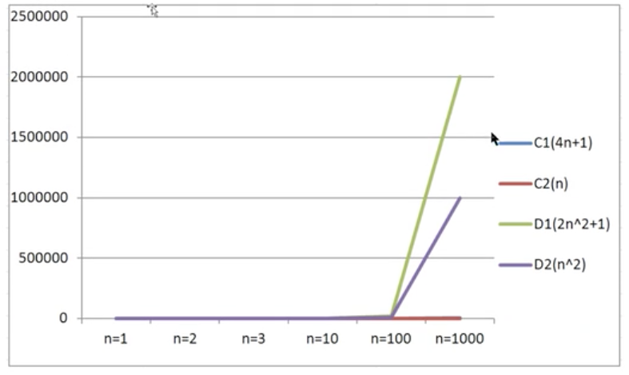

## 一、算法分析
研究算法的最终目的就是如何花最少的时间，如何占用更少的内存去完成相同的需求。不同算法之间存在时间耗费和空间耗费上的差异，但我们并不能将时间占用和空间占用量化。因此，我们需要理解有关算法时间耗费和算法空间耗费的描述和分析。有关算法时间耗费分析我们称之为算法的`时间复杂度分析`。有关算法的空间耗费分析，我们称之为算法的`空间复杂度分析`

## 二、 算法的时间复杂度分析

### 1. 时间复杂度分析的概述
主要计算算法时间耗费情况，首先我们得度量算法的执行时间

- **事后分析估算方法** ：通过设计好的测试程序和测试数据，利用计算机计时器对不同的算法编制的程序的运行时间进行比较，从而确定算法效率的高低

```java
public static void main(String[] args){
    long start = System.currentTimeMillis();
    int sum = 0;
    int n = 100;
    for (int i =1; i <= n; i++){
        sum+=i;
    }
    System.out.println("sum=" + sum);
    long end = System.currentTimeMillis();
    System.out.println(end-start);
    }
```

**缺陷：** 必须依据算法实现编制好的测试程序，通常要花费大量时间和精力，测试完了如果发现测试的是非常糟糕的算法，那么之前所做的事情就全部白费了，并且不同的测试环境（硬件环境）的差异导致测试的结果差异也很大

- **事前分析估算方法** ： 在计算机程序编写前，依据统计方法对算法进行「估算」，经过总结，我们发现一个高级语言编写的程序在计算机上运行所消耗的时间取决于下列因素：

1. **算法采用的策略和方案**
2. 编译产生的代码质量
3. **问题的输入规模**（所谓的问题输入规模就是输入量的多少 -> 设计需求）
4. 机器执行指令的速度

<font color = "deepPink"><b>由此可见，抛开这些与计算机硬件、软件有关的因素，<b>一个程序的运行时间依赖于算法的好坏和问题的输入规模</b>，如果算法固定，那么该算法的执行时间就只和问题的输入规模有关系了。</b></font>

- 以求和案例为例，进行分析：

**需求**：          
    计算1到100的和

第一种算法：

```java
// 如果输入量n为1，则需要计算1次；
// 如果输入量n为1亿，则需要计算1亿次；
public static void main(String[] args){
    int sum = 0; //执行1次
    int n = 100; //执行1次
    for (int i =0;i<=100;i++){ //执行了n+1次
        sum += i; //执行了n次
    }
    System.out.println("sum +" + sum);
}
```

第二种算法：

```java
// 如果输入量n为1，则需要计算1次；
// 如果输入量n为1亿，则需要计算1次；
public static void main(String[] args){
    int sum = 0; //执行1次
    int n = 100; //执行1次
    sum = (n+1)*n/2 // 执行1次
    System.out.println("sum +" + sum);
}
```

因此，当输入规模为n时，第一种算法执行了1+1+（n+1) +n = 2n+3次；第二种算法执行了1+1+1 = 3次。如果我们把第一种算法的循环体看作是一个整体，忽略结束条件的对比判断，那么其实这两个算法运行得差距就是 **n和1 的差距**

- 为什么可以忽略循环判断在算法1里执行了n + 1次 ？

例子：计算100个1 + 100个2 + 100个3 + 。。。。 + 100个100的结果

```java
public static void main(String[] args){
    int sum = 0; 
    int n = 100; 
    for (int i =0;i<=100;i++){ 
        for (int i=0;i<=100;i++){
            sum += i;
        }
    }
    System.out.println("sum +" + sum);
}
```

上面这个例子中，如果我们要精确地研究循环条件执行了多少次是一件很麻烦的事情，并且，由于真正计算机核心代码是内循环的循环体，所以在研究算法的效率时，我们只考虑核心代码的执行次数，这样可以简化分析

我们研究算法复杂度，侧重的是**当输入规模不断增大时，算法的增长量的一个抽象（规律）**。而不是精确地定位需要执行多少次，因为如果是这样的话，我们又得考虑回编译器优化等问题，容易主次颠倒

我们不关心编写程序所用的语言是什么，也不关心这些程序将泡在什么样的计算机上，我们只关心它实现的算法。这样，不计那些循环索引的递增和循环终止的条件、变量声明、打印结果等操作，最终在分析程序的运行时间时，最重要的是**把程序看作是独立于程序设计语言的算法或一系列步骤**。 我们分析一个算法的运行时间，最重要的就是把<font color="deepPink"><b>核心操作的次数和输入规模关联起来</b></font>。

### 2. 函数渐进增长
给定两个函数f(n) 和 g(n)， 如果存在一个整数N，使得对于所有的n > N， f(n) 总是比g(n) 大，那么我们说f(n) 的增长渐近快于g(n).

- <font color = "Gold"><b>随着输入规模的增大，算法的常数操作可以忽略不计</b></font>

输入规模|算法A1：2n+3执行次数|算法A2：2n执行次数|算法B1：3n+1执行次数|算法B2: 3n执行次数
----|-----|-----|-----|------|
n=1|5|2|4|3
n=10|23|20|31|30
n=100|203|200|301|300

<b>当输入规模n>2时，算法A1的渐近增长小于算法B1的渐近增长</b>

<p align="center">


</p>

通过观察折线图，我们发现，随着输入规模的增大，算法A1和算法A2逐渐重叠到一块，以此类推算法B1和算法B2，所以

<b>随着输入规模的增大，算法的常数操作可以忽略不计</b>

- <font color = "Gold"><b>随着输入规模的增大，与最高次项相乘的常数因子可以忽略不计</b></font> 

输入规模|算法C1：4n+8 执行次数|算法C2：n 执行次数|算法D1：2n^2 + 1执行次数|算法D2: n^2 执行次数
----|-----|-----|-----|------|
n=1|12|1|3|1
n=10|48|10|201|100
n=100|408|100|20001|10000

<p align="center">



</p>

通过观察折线图，很明显随着输入规模的增大，算法C1和算法C2几乎重叠，即使取出n^2 前面的常数因子，D系列的算法的操作次数要远远高于C系列

<b>随着输入规模的增大，与最高次项相乘的常数因子可以忽略不计</b>

- <font color = "Gold"><b>最高次项的指数大的，随着n的增长，结果也会变得增长特别快</b></font> 

输入规模|算法E1：2n^2+3n+1 执行次数|算法E2：n^2 执行次数|算法F1：2n^3 + 3n + 1执行次数|算法F2: n^3 执行次数
----|-----|-----|-----|------|
n=1|6|1|6|1
n=10|231|100|2031|1000
n=100|20301|10000|2000301|1000000

<p align="center">


</p>

- <font color = "Gold"><b>算法函数中n最高次幂越小，算法效率越高</b></font> 

输入规模|算法G：n^3 |算法G1：n^2 |算法G2：n |算法G3: log(n) |算法G4: 1
----|-----|-----|-----|------|------|
n=2|8|4|2|1|1
n=4|64|16|4|2|1

<p align="center">


</p>

综上所述，在我们比较算法随着输入规模的增长量时，可以有以下规则：
1. **算法函数中的常数可以忽略**
2. **算法函数中最高次幂的常数因子可以忽略**
3. **算法函数中最高次幂越小，算法效率越高**

### 3. 大O记法
在进行算法分析时，语句总的执行次数 `T(n)` 是**关于问题规模n 的函数**, 进而分析T(n) 随着n 的变化情况并确定 **T(n) 的量级**。

算法的时间复杂度，就是算法的时间量度，记做：**T(n) = O(f(n))** 

它表示随着问题规模n 的增大，算法执行时间的增长率和f(n) 的增长率相同，称作：**算法的渐近时间复杂度**，简称时间复杂度

其中f(n) 是问题规模n的某个函数

> **执行次数=执行时间**

用大写O（）来体现算法时间复杂度的记法，我们称之为「大O记法」。一般情况下，随着输入规模n的增大，T(n) 增长最慢的算法为最优算法

如果用大O记法表示上述每个算法的时间复杂度，基于我们对函数渐进增长的分析，推导大O记法的表示法有以下几个规则：
1. 用常数1 取代运行时间中的所有操作常数
2. 在修改后的运行次数中，只保留最高阶项
3. 如果最高阶项存在，且常数因子不为1，则去除与这个项相乘的常数

#### 案例
1. 算法一执行次数 = 3次    ----> **O（1）**
2. 算法二执行次数 = n + 3次    ----> **O（n）**
3. 算法三执行次数 = n^2 + 2次    ----> **O（n^2）**

### 4. 常见的大O阶
#### a. 线性阶
一般含有非嵌套循环涉及线性阶，线性阶就是随着输入规模的扩大，对应计算次数呈直线增长

```java
public static void main(String[] args){
    int sum = 0;
    int n = 100;
    for (int i = 1; i <= n; i++){
        sum += i;
    }
    System.out.println("sum = " + sum);
}
```

上述这段代码，它的循环的时间复杂度为O(n) 因为循环体中的代码需要执行n次

#### b. 平方阶
一般嵌套循环属于这种时间复杂度
```java
public static void main(String[] args){
    int sum=0, n =100;
    for (int i =1;i <= n;i++){
        for (int j=1; j<= n; j++){
            sum += i; //核心代码
        }
    }
}
```
上述这段代码，外层循环每执行一次，内层循环就执行100次，那么总共程序想要从这两个循环中出来的，就需要执行100*100次， 也就是n 的平方次。
所以这段代码的时间复杂度是O(n^2)

#### c. 立方阶
一般三层嵌套循环属于这种时间复杂度。
那总共程序想要从三个循环中出来就需要执行n^3，所以这种类型代码的时间复杂度是O(n^3)

#### d. 对数阶

```java
int i=1, n=100;
while(i<n){
    i = i*2
}
```

由于每次i*2之后，就距离n更进一步，假设有x个2相乘后大于n，则会退出循环。由于是2^x = n 得到x = log<sub>2</sub>(n)

> 对于对数阶，由于随着输入规模n的增大，不管底数为多少，他们的增长趋势是一样的，我们会忽略底数记为O(log(n))

#### e.常数阶
一般不涉及循环操作的都是常数阶，因为它不会随着n 的增长而增加操作次数

根据大O推导法则，常数用1来替换，所以时间复杂度为O(1)

#### 常见时间复杂度的总结
描述|增长的数量级|说明|举例
-----|------|-----|-----|
常数级别|1|普通语句|将两个数相加
对数级别|logN|二分策略|二分查找
线性级别|N|循环|找出最大元素
线性对数级别|N*logN|分治思想|归并排序
平方级别|N<sup>2</sup>|双层循环|检查所有元素对
立方级别|N<sup>3</sup>|三层循环|检查所有三元组
指数级别|2<sup>N</sup>|穷举查找|检查所有子集

他们的复杂程度从低到高依次为：

O(1) < O(logn) < O(n) < O(n*logn) < O(n<sup>2</sup>) < O(n<sup>3</sup>) < O(2<sup>n</sup>) < O(n<sup>n</sup>)

我们发现，从平方阶开始，随着输入规模的增大，时间成本会急剧增大，所以，我们的算法，尽可能的追求的是O(1),O(logn),O(n),O(n*logn)这几种时间复杂度，而如果发现算法的时间复杂度为平方阶、立方阶或者更复杂的，那我们可以分为这种算法是不可取的，需要「优化」

### 5. 函数调用的时间复杂度分析
之前，我们分析的都是单个函数内，算法代码的时间复杂度。接下来我们分析函数调用过程中时间复杂度

#### 案例一

```java
public static void main(String[] args){
    int n = 100;
    for (int i =0; i<n; i++){
        show(i);
    }
}

private static void show(int i){
    System.out.println(i)
}
```

在main 方法中，有一个for 循环，循环体调用了show的方法，由于show方法内部只执行了一行代码，所以show方法的时间复杂度为O(1) ， 那Main 方法的时间复杂度就是 O(n)

#### 案例二

```java 
public static void main(String[] args){
    int n =100;
    for (int i=0;i<n;i++){
        show(i)
    }

private static void show(int i){
    for (int j=0; j<i;j++){
        System.out.println(i)
    }
}
}
```

在Main 方法中，有一个for循环，循环体调用了show方法，由于show方法内部也有一个for循环，所以show方法的时间复杂度为 O(N);那main方法的时间复杂度为O(n^2)

#### 案例三：

```java
public static void main(String[] args){
    int n = 100;
    show(n);
    for (int i =0;i<n;i++){
        show(i);
    }
    for (int i =0;i<n;i++){
        for (int j =0;j<n;j++){
            System.out.println(j);
        }
    }
}
private static void show(int i){
    for (int j=0;j<i;j++){
        System.out.println(i);
    }
}
```
在show方法中有一个for 循环，所以show方法的时间复杂度为O(n), 在main方法中，show(n) 这行代码内部执行的次数为n，第一个for循环内调用了show方法，所以其执行次数为n^2，第二个嵌套for循环内只执行了一行代码，所以其执行次数为n^2,那么main方法总共执行次数为n+n^2+n^2=2n^2 + n。 根据大O推导规则，去掉n保留最高阶项，并去掉最高阶项的常数因子2，所以最终main方法的时间复杂度为O(n^2)

### 6.最坏情况
一般人处于一种对未来失败的担忧，而在预期的时候趋向做最坏的打算，这样即使最糟糕的结果出现，当事人也有了心理准备，比如容易接受结果。假如最糟糕的结果并没有出现，当事人会很快乐

算法分析也是类似，假如有一个需求： 有一个存储了n个随机数字的数组，请从中查找出制定的数字

```java 
public int search(int num){
    int[] arr = {11,10,8,9,7,22,23,0};
    for (int i =0; i<arr.length;i++){
        if (num == arr[i]){
            return i;
        }
    }
    return -1;
}

```

- **最好情况**：查找的第一个数字就是期望的数字，那么算法的时间复杂度为O（1）
- **最坏情况**：查找的最后一个数字，才是期望的数字，那么算法的时间复杂度为O(n)
- **平均情况**：任何数字查找的平均成本是O(n/2)

最坏情况是一种保证，在应用中，这是一种最基本的保障，即使在最坏情况下，也能够正常提供服务满足需求。所以，除非特别制定，我们提到的运行时间都指的是最坏情况下的运行时间/执行次数

## 三、算法的空间复杂度分析
计算机的软硬件都经历了一个比较漫长的演变史，作为运算提供环境的内存，更是如此，从早些时候的512k，经历了1M,2M,4M...等，发展到现在的8G,甚至16G和32G，所以早期，算法在运行过程中对内存的占用情况也是一个经常需要考虑的问题。我们可以用算法的空间复杂度来描述算法对内存的占用

### 1. java中常见内存占用

- 基础数据类型内存占用情况

数据类型|内存占用字节数
----|-----|
byte|1
short|2
int|4
long|8
float|4
double|8
boolean|1
char|2

- 计算机访问内存的方式都是一次一个字节

<p align="center">


</p>

- 一个引用（机器地址）需要8个字节表示

例如：Data **date** = new Date() 

则data这个变量需要占用8个字节来表示

- 创建一个对象，比如new Date(), 除了Date对象内部存储的数据（例如年月日等信息）占用的内存，该对象本身也有内存开箱，每个对象的自身开销是16个字节，用来保存对象的头信息

- 一般内存的使用，如果不够8个字节，都会被自动填充为8字节

```java
public class A{
    public int a = 1;
}
```

通过new A() 创建一个对象的内存占用如下：
1. 整型成员变量a 占用 4 个字节
2. 对象本身占用 16个字节

那么创建该对象总共需要20个字节，但由于不是以8为单位，会自动填充为24个字节

- java中数组被限定为对象，他们一般都会因为记录长度而需要额外的内存，一个原始数据类型的数组一般需要24字节的头信息（16个自己的对象开销，4字节用于保存长度以及4个填充字节）再加上保存值所需的内存

### 2. 算法的空间复杂度
了解了java的内存最基本的机制，就能够有效帮助我们估计大量程序的内存使用情况

算法的空间复杂度计算公式记做： **S(n) = O(f(n))** 其中 n为输入规模，f(n)为语句关于n所占存储空间的函数。

**案例**：对指定的数组元素进行反转，并返回反转的内容

1. 解法一

```java
public static int[] reverse1(int[] arr){
    int n = arr.length //申请4个字节
    int temp; // 申请4个字节
    for(int start = 0,end = n-1; start <= end; start++,end--){
        temp = arr[start];
        arr[start] = arr[end];
        arr[end] = temp
    }
    return arr;
}
```

2. 解法二

```java
public static int[] reverse2(int[] arr){
    int n = arr.length;//申请4个字节
    int[] temp = new int[n]; //申请n*4个字节作为保存值 + 数组自身头信息开销24个字节
    for (int i=n-1; i>=0;i--){
        temp[n-1-i] = arr[i];
    }
    return temp;
}
```

忽略判断条件占用的内存，我们得出的内存占用情况如下：
- 解法一：不管传入的数组大小为多少，始终额外申请4+4 = 8个字节 -> S(n) = O(1)
- 解法二：S(n) = 4+4n+24 = 4n+28 = O(n)

根据大O推导法则，算法一的空间复杂度为O（1），算法二的空间复杂度为O（n),所以从空间占用的角度讲，算法一要优于算法二。

## 四、 算法分析的总结

由于java中有内存垃圾回收机制，并且jvm对程序的内存占用也有优化（例如即时编译），我们无法精确地评估一个java程序的内存占用情况，但是了解了java的基本内存占用，使我们可以对java程序的内存占用情况进行估算

由于现在的计算机设备内存一般都比较大，基本上个人计算机都是4G起步，大的可以达到32G，64G，所以内存占用一般情况下并不是我们算法的瓶颈，普通情况下直接说复杂度，默认为算法的时间复杂度。

但是，如果你做的程序是嵌入式开发，尤其是一些传感器设备上的内置程序，由于这些设备的内存很小，一般为几KB，这个时候对算法的空间复杂度就有要求了，但是一般做java开发的，基本上都是服务器开发，一般不存在这样的问题。

