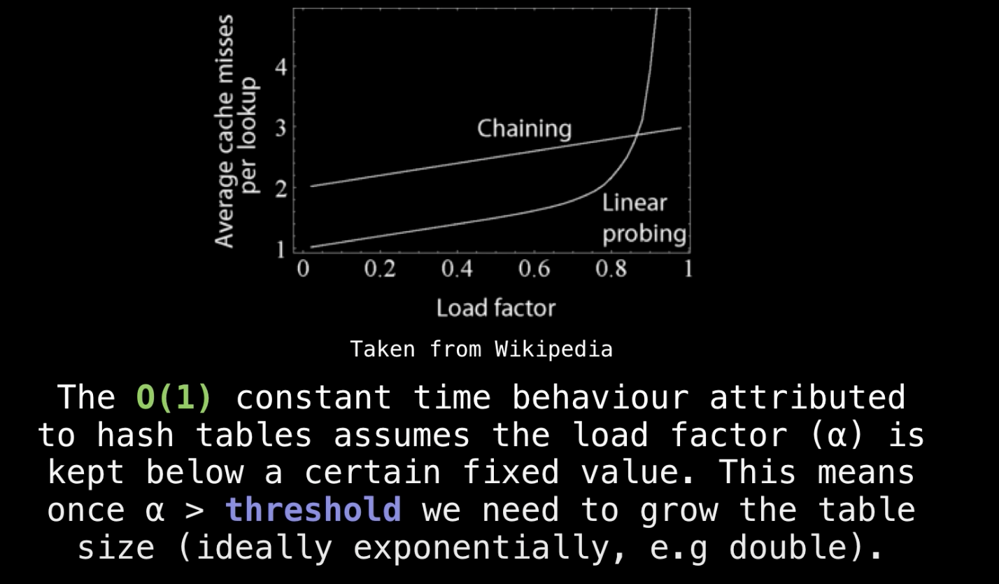

|[Arrays](#Arrays)|[Linked List](linkedlist)|[Hash table](hashtable)|[Heaps](heap)|
|-------|-------|-------|-------|

## Arrays
### [Static Arrays](https://www.interviewcake.com/concept/python/array?)

- A static array is a fixed length container containing n elements **indexable** from range [0,n-1]
- **Indexable**: each slot/index in the array can be referenced with a number 

#### Uses
1. Storing and accessing sequential data 
2. Temporaritly storing objects 
3. Used by IO routines as buffers 
4. Lookup tables and inverse lookup tables 
5. Used as multiple values return or args input from a function 
6. Used in DP to cache ansers to subproblems 

#### Strengths

- **Fast lookups**: Retrieving the element at a given index takes O(1) time, regardless of the length of the array.

#### Weaknesses
- **Fixed size**: You need to specify how many elements you're going to store in your array ahead of time. (Unless you're using a fancy dynamic array.)
- **Costly inserts and deletes**: You have to "scoot over" the other elements to fill in or close gaps, which takes worst-case O(n) time.

#### Declaration : java 
```java
 int gasPrices[] = new int[10];

gasPrices[0] = 346;
gasPrices[1] = 360;
gasPrices[2] = 354;
```

#### Time Complexity 

Ops|Average Case|Worst Case 
---|---|---|
Space|O(n)|O(n)
Access|O(1)|O(1)
Appending|N/A|N/A
Insertion|N/A|N/A
Deletion|N/A|N/


### [Dynamic Arrays](https://www.interviewcake.com/concept/python/dynamic-array)

- **Automatic Resizing**: like one dimensional arrays, but have **reserved space for additional elements**. If a dynamic array is full, it **copies its contents to a larger array.**

#### Strengths

- **Fast lookups** :Just like arrays, retrieving the element at a given index takes O(1)O(1) time.
- **Variable size**: You can add as many items as you want, and the dynamic array will expand to hold them.
- **Cache-friendly**: Just like arrays, dynamic arrays place items right next to each other in memory, making efficient use of caches.

#### Weaknesses

- **Slow worst-case appends**: Usually, adding a new element at the end of the dynamic array takes O(1)O(1) time. But if the dynamic array doesn't have any room for the new item, it'll need to expand(copy all the elements and double size of array), which takes O(n) time.
- **Costly inserts and deletes**: Just like arrays, elements are stored adjacent to each other. So adding or removing an item in the middle of the array requires "scooting over" other elements, which takes O(n) time.

#### Implementation : Python 
```python 
# In Python, dynamic arrays are called lists.
gas_prices = []

gas_prices.append(346)
gas_prices.append(360)
gas_prices.append(354)
```

#### Notes 

#### Size v.s Capacity 
     

We'd say this dynamic array's size is 4 and its capacity is 10. The dynamic array stores an end_index to keep track of where the dynamic array ends and the extra capacity begins.

#### Doubling Space 
What if we try to append an item but our array's capacity is already full?<br>
To make room, dynamic arrays automatically make a new, bigger underlying array. Usually twice as big. and each item has to be individually copied into the new array.

> Notes: Why not just extend the existing array? Because that memory might already be taken by another program.


#### Time Complexity

Ops|Average Case|Worst Case 
---|---|---|
Space|O(n)|O(n)
Access|O(1)|O(1)
Appending|O(1)|O(n)
Insertion|O(n)|O(n)
Deletion|O(n)|O(n)

## Hash table 

- Hash table provides a mapping from keys to values using a technique called **hashing**
- A hash table/Dictionary organizes data so you can quickly look up values for a given key.
- Key-value pairs can be of any type not just strings and numbers but also objects. But keys needs to be **hashable** 

<p>

</p>

### Uses

- Frequencies: Hash tables are often used to track item frequencies. For example, counting the number of times a word appears in a given text. 

### Hash table mapping (key->value)

- **Hash table is built on arrays**

Arrays are pretty similar to hash maps already. Arrays let you quickly look up the value for a given "key" . . . except the **keys are called "indices,"** and we don't get to pick them—they're always sequential integers (0, 1, 2, 3, etc). **Think of a hash map as a "hack" on top of an array** to let us use flexible keys instead of being stuck with sequential integer "indices."

### Hashing Function

- **Definition** : 

A hash function maps a key 'x' to a whole number in a fixed range

- **Implementation in hash table**

A function to **convert a key into an array index (an integer)**. To look up the value for a given key, we just run the key through our hashing function to get the index to go to in our underlying array to grab the value.

<p>

</p>

#### Hashing function exmaples

##### Hash function for arbitrary objects such as strings/lists: ASCII

The hash function H(s) can be defined as the ASCII(x) value of the character x and H(S)= sum(ASCII(x)). Grab the number value for each character and add those up

``` python
  def H(s):
    sum = 0
    for char in s:
        sum = sum + ASCII(char)
    return sum mod 30 
```

<p>

</p>

The result is 429. But what if we only have 30 slots in our array? We'll use a common trick for forcing a number into a specific range: the modulus operator (%). Modding our sum by 30 ensures we get a whole number that's less than 30 (and at least 0): 

> 429%30 = 9

##### Hash function for integer key: Modular
For example, H(X) = (x^2 - 6x +9) mod 10 maps all integer keys to the range [0,9]
```
H(4) = (16 - 24 +9) mod 10 = 1 
H(-7) = (49 + 42 + 9 ) mod 10 = 0
```

> Notes: The hashing functions used in modern systems get pretty complicated—the one we used here is a simplified example.

#### **Properties**

1. If H(x) = H(y), then objects x and y **might be equal**, but if H(x) != H(y) then x and y are **certainly not equal** 

> This means that instead of comparing x and y directly, a smarter approach is to first compare their hash values ( O(1) ), and only if the hash values match do we need to explicitly compare x and y 

2. A hash function must be **deterministic** 

> This means tat if H(X) = y then H(X) must always product y and never another value. 

#### Notes 

> A good hash function should have following properties

1) Efficiently computable.
2) Should uniformly distribute the keys (Each table position equally likely for each key)

> A key of type T is **hashable**  
 
To enforce a deterministic hash function, we demand that the keys used in the hash table are **immutable** data types. If a key of type T is immutable and we have a hash function H(k) defined for all keys k of type T then we say a key of type T is hashable

> Ideally we would like to have a very fast lookup and other operations for the data we are placing within the hash table    
 
Remarkably we can achieve this in O(1) time using a **hash function as a way to index into a hash table**. The constant time behavior attributed to hash tables is only true if you have a good **uniform hash function**


### Collisions Handling

**Definition**: Hash Collisions happens while two keys hash to the same index in the "array". The situation where a newly inserted key maps to an already occupied slot in the hash table is called a collision. 

<p>

</p>

#### Separate Chaining

<p>

</p>

The idea is to make each cell of hash table point to a linked list of records that have the same hash function value. Chaining is simple but requires additional memory outside the table.

Instead of storing the actual values in our array, let's have each array slot hold a pointer to a linked list holding the values for all the keys that hash to that index:

> Notice that we **included the keys as well as the values** in each linked list node. Otherwise, we wouldn't know which key was for which value!

#### Chaining Implementation
1) To find the key, we first hash the key x to obtain the hash value (index) h(x)
2) After this, we search the h(x) bucket (look through the linked list) for the key x and value

##### Advantages
1) Simple to implement.
2) Hash table never fills up, we can always add more elements to the chain.
3) Less sensitive to the hash function or load factors.
4) It is mostly used when it is unknown how many and how frequently keys may be inserted or deleted.

##### Disadvantages
1) Cache performance of chaining is not good as keys are stored using a linked list. Open addressing provides better cache performance as everything is stored in the same table.
2) Wastage of Space (Some Parts of hash table are never used)
3) If the chain becomes long, then search/insertion time can become O(n) in the worst case.
4) Uses extra space for links.

##### FAQs

  * **How to maintain O(1) insertion and lookup time complexity once hash table with separate Chaining gets really full ( long linked list chains )?**

Ans: We should create a new HT with a larger capacity and rehash all the items inside the old HT and disperse them throughout the new HT at different locations 

  * **How to remove key-value pairs from HT?**

Ans : Apply the same procedure as doing a lookup for a key but instead of returing the value associated with the key, remove the node in the linked list data structure 

### [Hash table separate chaining source code](https://www.youtube.com/watch?v=Av9kwXkuQFw&list=PLDV1Zeh2NRsB6SWUrDFW2RmDotAfPbeHu&index=31)


#### Open Addressing

<p>

</p>

Open addressing techniques deals with hash collisions by finding another place within the hash table for the object to go by **offsetting it from the position to which it hashed to**. The key-value pairs are stored in the table(array) itself as opposed to a data structure like in separate chaining    
In open addressing, All elements are stored in the hash table itself. Each table entry contains either a record or NIL. 

> Notes: At any point, size of the table must be greater than or equal to the total number of keys ( we can increase table size by copying old data if needed).
 
- **Load Factor**

When using open addressing as a collision resolution technique, we need to care a great deal about the size of our hash table and how many elements are currently in the table 
```
Load factor = items in table/size of table
```


-  Assume the max load facor = a, then threshold before resize = N * a (the number of element allowed in the table before resize)

##### Implementations 

When we want to insert a (k,v) into the hash table, 
1. we obtain the original position by hashing the key H(k)
2. If the posiiton the key hashed to is occupied, we try another position in the hash table by offsetting the current position subject to **probing sequence P(X)**
3. We keep doing this until an unoccupied slot is found 
4. Before we insert the next pair, if we have reached the threshold value, we need to grow the table which usuallly done in some exponential fashion such as doubling the table size whatever you do make suze GCD(N,a) = 1 still holds 
    1) The new threshold value = 2*N*a 
    2) The probing function p(x) does not change 
    3) Upon allocating memory for a new table, we need to insert the contents of the old table into the new table using new hash function H'(x) which takes O(n)

```python
# General insertion method for open addressing on a table of size N 
    def insert(x):
        x = 1
        keyHash = H(k)
        index = keyHash 
        while table[index] != None:
            index = (KeyHash + P(k,x)) mod N
            x = x+1
        insert(k,v) at table[index]
# H(k) is the hash for the key k 
# P(k,x) is the probing function 
```

##### Key searching 

**Search(k)**: Keep probing until slot’s key doesn’t become equal to k or an empty slot is reached.

##### [Key removal](https://www.youtube.com/watch?v=7eLDTtbzX4M&list=PLDV1Zeh2NRsB6SWUrDFW2RmDotAfPbeHu&index=36)

**Delete(k)**: Delete operation is interesting. If we simply delete a key, then search may fail because the probing would stop at null/empty slot. So slots of deleted keys are uniquely marked specially as “deleted” called a **tombstone**.

> Notes : Insert can insert an item in a deleted slot, but the search doesn’t stop at a deleted slot.

**Removing Tombstone**:
1) Tombstones count as filled slots in the HT so they increase the load factor and will be removed when the table is resized 

2) when inserting a new (k,v) pair you can replace buckets with tombstones with the new pair

##### Probing sequence

###### Problems with probing: chaos with cycles 
Most randomly selected probing sequence modulo N will product a cycle shorter than the table size. This becomes problematic when you are trying to insert a key-value pair and all the buckets on the cycle are occupied because you will get stuck in the **infinite loop**


The cycle makes it impossible to reach other buckets and this would cause an infinite loop in HT iif all the buckets it go through were already occupied 

- **How do we handle probing functiosn which produce cycles shorter than the table size?**

In general, the consensus is that we don't handle this issue, instead we avoid it altogheter by restriciting our domain of probing functions to those which produce a cycle of exactly length N*

###### [Linear probing](https://www.youtube.com/watch?v=Ma9XOInZJWM&list=PLDV1Zeh2NRsB6SWUrDFW2RmDotAfPbeHu&index=33)

LP is a probing method which probes according to a linear formula, 

```
P(X) = ax+ b where a(!= 0), b(= 0) are constants 
```

 - Which value(s) of the constant a in P(x) = ax produce a full cycle modulo N? 

 This hapens when a and N are **relatively prime**. Hence, when GCD(a,N) = 1 the probing function P(x) be able to generate a complete cycle and we will always be able to find am **empty bucket**

> Common choice for linear P(x) is P(x) = 1x since GCD(N,1) = 1 no matter the choice of N(table size)


- **Clustering** : The main problem with linear probing is clustering, many consecutive elements form groups and it starts taking time to find a free slot or to search an element.


###### [Quadratic probing](https://www.youtube.com/watch?v=b0858c55TGQ&list=PLDV1Zeh2NRsB6SWUrDFW2RmDotAfPbeHu&index=34)
QP is a probing method which probes according to a quadratic formula, 

```
P(X) = ax^2 + bx + c, where a,b,c are constants and a!= 0 
```

- Some quadratic probing function we can work with without generating cycle:

1) Let p(x) = x^2, keep the talbe size a prime number > 3 and also keep load factor <= 1/2
2) Let p(x) = (x^2 + x)/2 and keep the table size a power of two 
3) Let p(x) = （-1^x) * x^2 and keep the table size of prime N where N = 3 mod 4

###### [Double hashing](https://www.youtube.com/watch?v=H5e9V5x92vI&list=PLDV1Zeh2NRsB6SWUrDFW2RmDotAfPbeHu&index=35)

DH is a probing method which probes according to a constant multiple of another hash fucntion 

```
P(k,x) = x * H'(k), wherhe H'(k) is a secondary hash function and H'(k) must hash the same type of keys as H(k)
```

> Doubling hashing reduces to linear probing (except that the constant is unknowm until runtime )

- To fix the issue of cycles we pick the table size to be a prime number and also compute the value of delta :

> delta  = H'(k) mod N

If delta = 0 then we are guaranteed to be stuck in a cycle so we set delta = 1 at this point
 
Notice that 1 <= delta N and GCD(delta,N) = 1 since N is prime. Hence, with these conditions we know that modulo N the sequence : H(k),H(k) + 1delta,H(k)+2delta is certain to have order N

- Constructing H'(k)

Frequently the hash functions selected to compose H'(k) are picked from a pool of hash functions called **universal hash functions** which generally operate on one fundamental data type 


##### [Souce code](https://www.youtube.com/watch?v=eer6yW4S4Ts&list=PLDV1Zeh2NRsB6SWUrDFW2RmDotAfPbeHu&index=37)

#### Open Addressing v.s Separate Chaining

Both function generate O(1) search/insert function in aveage case and O(n) in worst case. The advantages of using separate Chaining are that we don't need to care about the resizing since the table will always not get filled (but we do need to resize if the table grows too large), and the choice of hash function is not sensitive and easy to implement. However the cache performance is worse than open addressing because it is not cache friendly. And we need extra space for the other data strucutre( i.e linked list)
Open addressing holds all the element in one table which reduce the usage of space and generate great performance in cache since all the element are hold in one chunk of memory. However, open address is not easy to implement and is sensitive to the choice of probing function and hash function to avoid cycling/infinite loop. Also the table may become filled and we need to care about the size of table and the threshold. 

NO.|Seprate Chaining|Open Addressing
----|----|----|
1.|Chaining is Simpler to implement.|Open Addressing requires more computation. It is also sensition to chosen hash function and probing function
2.|In chaining, Hash table never fills up, we can always add more elements to chain.|In open addressing, table may become full.
3.|Chaining is Less sensitive to the hash function or load factors.|Open addressing requires extra care for to avoid clustering and load factor.
4.|Chaining is mostly used when it is unknown how many and how frequently keys may be inserted or deleted.|Open addressing is used when the frequency and number of keys is known.
4.|Cache performance of chaining is not good as keys are stored using linked list.|Open addressing provides better cache performance as everything is stored in the same table.
5.|Wastage of Space (Some Parts of hash table in chaining are never used).|In Open addressing, a slot can be used even if an input doesn’t map to it.
6.|Chaining uses extra space for links.	|No links in Open addressing


### When hash table operations cost O(n) time

- **Hash collisions**
If all our keys caused hash collisions, we'd be at risk of having to walk through all of our values for a single lookup (in the example above, we'd have one big linked list). This is unlikely, but it could happen. That's the worst case.

- **Dynamic array resizing**
Suppose we keep adding more items to our hash map. As the number of keys and values in our hash map exceeds the number of indices in the underlying array, hash collisions become inevitable.
To mitigate this, we could expand our underlying array whenever things start to get crowded. That requires **allocating a larger array and rehashing all of our existing keys to figure out their new position—O(n) time**.

### Strenths 

- **Fast lookups** Lookups take O(1) time on average.
- **Flexible keys** Most data types can be used for keys, as long as they're hashable.

### Weaknesses 

- **Slow worst-case lookups**: Lookups take O(n) time in the worst case.
- **Unordered**: Keys aren't stored in a special order. If you're looking for the smallest key, the largest key, or all the keys in a range, you'll need to look through every key to find it.
- **Single-directional lookups**: While you can look up the value for a given key in O(1) time, looking up the keys for a given value requires looping through the whole dataset—O(n)time.
- **Not cache-friendly**:  Many hash table implementations use linked lists, which don't put data next to each other in memory.

# Declaration in python 
In Python 2.7, hash tables are called dictionaries.
```python
  light_bulb_to_hours_of_light = {
    'incandescent': 1200,
    'compact fluorescent': 10000,
    'LED': 50000,
}
```

### Time Complexity 
Ops|Average Case|Worst Case 
---|---|---|
Space|O(n)|O(n)
Insert|O(1)|O(n)
Lookup|O(1)|O(n)
Delete|O(1)|O(n)

## Sets  
A set is like a hash map except it only stores keys, without values. 

### Uses 
- **Graphs** :  
Sets often come up when we're tracking groups of items—nodes we've visited in a graph, characters we've seen in a string, or colors used by neighboring nodes. Usually, we're interested in whether something is in a set or not.

### Implementation 
Sets are usually implemented very similarly to hash maps—using hashing to index into an array—but they don't have to worry about storing values alongside keys. 

```python 
  light_bulbs = set()

light_bulbs.add('incandescent')
light_bulbs.add('compact fluorescent')
light_bulbs.add('LED')

'LED' in light_bulbs  # True
'halogen' in light_bulbs  # False
```


## Binary Heap

- A binary heap is a **binary tree** where the **smallest value** is always at the **top**

<p align="center">

</p>

### Types 

- **Max Heap**: the key present at the root node must be greatest among the keys presented at all of its children. **The same property must be recursively true for all sub trees in that Binary Tree**

- **Min Heap**: the key present at the root node must be minimum among the keys presented at all of its children. **The same property must be recursively true for all sub trees in that Binary Tree**

### Heap Uses

- **Priority queues**: implemented using heaps. Items are enqueued by adding them to the heap, and the highest-priority item can quickly be grabbed from the top.
- **Heap sort**: make a heap out of them and then remove items one at a time—in sorted order.

### Implementation 

#### Heaps are implemented as complete binary trees

> In a complete binary tree:
> - Each level is filled up before another level is added
> - The bottom tier is filled in **from left to right**.  
> As we'll see, this allows us to efficiently store our heap as a list.

#### Heaps are built on lists

- Complete trees and heaps are often stored as lists, one node after the other, like this:
<p align="center">

</p>

- Using a list to store a complete binary tree is very efficient because there no need to spend extra space for pointer. Since there are no gaps in complete tree (Each level is filled up before another level is added and bottom tier is filled in **from left to right**. ), there are no unused bucket/slots in the list/array. 

- Inserting a new item in the bottom right part of the tree just means appending to the list.

##### **How do we traverse the tree when it's a list?**
With a bit of clever indexing

- **Left Child**: Index 0's left child is at index 1. Index 1's left child is at index 3. And index 2's left child is a 5. In general, a node at index ii's left child will be at index **2*i + 1**

- **Right Child**: This node always comes right after the left child. In general, a node at index ii's right child will be at index **2*i + 2**

- **Parent**: The nodes at indices 1 and 2 have their parent at index 0. The nodes at indices 3 and 4 have their parent at index 1. And the nodes at indices 5 and 6 have their parent at index 2. In general, a node at index i has its parent at index **(i-1)/2**

>Just remember the main idea is that you're multiplying or dividing by 2. This makes sense, because the number of nodes on each level of a complete binary tree doubles as you move down level by level.

#### In a heap, **every node is smaller than its children**.
<p align="left">


</p>

#### Insertion

1. Add the item to the bottom of the tree 
<p align="center">

</p>

2. Compare the item with its parent. If the new item is smaller, swap the two.
<p align="center">

</p>

3. Continue comparing and swapping, allowing the new item to **"bubble up"** until the it's larger than its parent.
<p align="center">

</p>

- Because our heap is built on a complete binary tree, we know it's also **balanced**. Which means the height of the tree is log(n). So we'll do at most log(n) of these swaps, giving us a total time cost of O(log(n)).

#### Removing the smallest item

1. Remove the root 
<p align="center">

</p>

2. Take the bottom level's right-most item and move it to the top, to fill in the hole.
<p align="left">


</p>

3. Compare the item with its children: 

If it's larger than **either** child, swap the item with the smaller of the two children.
<p align="center">

</p>

4. Continue comparing and swapping, allowing the item to **"bubble down"** until it's smaller than its children.
<p align="center">

</p>

- As with inserting (above), we'll do at most log(n) of these swaps, giving us a total time cost of O(log(n))

#### Source Code 

<details>
<summary><b>Python</b></summary>

```python 
# A Python program to demonstrate common binary heap operations 
  
# Import the heap functions from python library 
from heapq import heappush, heappop, heapify  
  
# heappop - pop and return the smallest element from heap 
# heappush - push the value item onto the heap, maintaining 
#             heap invarient 
# heapify - transform list into heap, in place, in linear time 
  
# A class for Min Heap 
class MinHeap: 
      
    # Constructor to initialize a heap 
    def __init__(self): 
        self.heap = []  
  
    def parent(self, i): 
        return (i-1)/2
      
    # Inserts a new key 'k' 
    def insertKey(self, k): 
        heappush(self.heap, k)            
  
    # Decrease value of key at index 'i' to new_val 
    # It is assumed that new_val is smaller than heap[i] 
    def decreaseKey(self, i, new_val): 
        self.heap[i]  = new_val  
        while(i != 0 and self.heap[self.parent(i)] > self.heap[i]): 
            # Swap heap[i] with heap[parent(i)] 
            self.heap[i] , self.heap[self.parent(i)] = ( 
            self.heap[self.parent(i)], self.heap[i]) 
              
    # Method to remove minium element from min heap 
    def extractMin(self): 
        return heappop(self.heap) 
  
    # This functon deletes key at index i. It first reduces 
    # value to minus infinite and then calls extractMin() 
    def deleteKey(self, i): 
        self.decreaseKey(i, float("-inf")) 
        self.extractMin() 
  
    # Get the minimum element from the heap 
    def getMin(self): 
        return self.heap[0] 
  
# Driver pgoratm to test above function 
heapObj = MinHeap() 
heapObj.insertKey(3) 
heapObj.insertKey(2) 
heapObj.deleteKey(1) 
heapObj.insertKey(15) 
heapObj.insertKey(5) 
heapObj.insertKey(4) 
heapObj.insertKey(45) 
  
print heapObj.extractMin(), 
print heapObj.getMin(), 
heapObj.decreaseKey(2, 1) 
print heapObj.getMin() 
  
# This code is contributed by Nikhil Kumar Singh(nickzuck_007)
```

</details>

### Heapify

**Transform a List Into a Heap** 

- We could create a new empty heap and add in the items from the list one at a time. If the list has n elements, then this takes **O(n*log(n))**

#### Implementation : Bubbling down 

- More efficient: We'll take our input list and treat it like the nodes in a complete binary tree, just like we did above:

<p align="center">

</p>

To transform the tree into a valid heap, we'll compare each node to its children and move nodes around so that parent nodes are always smaller than their children.This causes larger nodes to move lower in the tree, **"bubbling down"** to allow smaller values to reach the top.

> Look familiar? This is the same bubbling down we were doing to remove items from the heap!

1) We'll work from the leaf-nodes at the bottom upwards. To start off, let's look at the leaves. The leaf nodes don't have any children, so they don't need to move down at all. Great.

<p align="center">

</p>

2) Let's look at the nodes in the next level:

<p align="center">

</p>

Since 3 is smaller than both 7 and 9, it's already in the right spot.

But, looking at the right node (2) and its children, since 1 is smaller than 2, we'll swap them.

<p align="center">

</p>

3) Moving up, we've got an 8 at the root.

Since 8 is larger than 1, 8 bubbles down, swapping places with the smaller child: 1.

<p align="left">


</p>


At this point, we've transformed the input tree into a valid min heap. Nice!

#### [Heapify complexity: O(n)](https://www.interviewcake.com/concept/python/heap)

- It's tempting to say it's O(n*log(n)). After all, we have to examine all n nodes, and a node might bubble down O(log(n)) levels.

That's an overestimate of the amount of work though. All of the leaf nodes at the bottom of the tree won't have to move down at all. And the parents of those nodes will only move down once. In fact, there's only one node that might move down O(log(n)) times: the root node.

- After computing the time complexity carefully, we finally get the O(n)

### Strengths
- **Quickly access the smallest item**: Binary heaps allow you to grab the smallest item (the root) in O(1) time, while keeping other operations relatively cheap (O(lg(n)) time).
- **Space efficient**: Binary heaps are usually implemented with **lists**, saving the overhead cost of storing pointers to child nodes.

### Weaknesses
- **Limited interface**: Binary heaps only provide easy access to the smallest item. Finding other items in the heap takes O(n) time, since we have to iterate through all the nodes.


### Time Complexity

Ops|Worst Case 
---|---|
Get min|O(1)
Remove min|O(lg(n))
Insert|O(lg(n))
Heapify|O(n)
Space|O(n)

## PriorityQueue

A priority queue is a special queue where:

- Every item in the queue has a priority

- Higher-priority items are dequeued before lower-priority items.

> Picture a big list of bugs for an engineering team to tackle. You want to keep the highest-priority bugs at the top of the list.

<p align="center">

</p>

### Uses 
- Any time you want to handle things with different priority levels: triaging patients in a hospital, locating the closest available taxi, or just a to-do list.

- **Operating system schedulers** may use priority queues to select the next process to run, ensuring high-priority tasks run before low-priority ones.

- Certain foundational algorithms rely on priority queues:
  * Dijkstra's shortest-path
  * A* search (a graph traversal algorithm like BFS)
  * Huffman codes (an encoding for data compression)

### Implementations

#### Binary Heaps
Priority queues are often implemented using binary heaps. Notice how the highest priority is right at the top of the heap, ready to be grabbed in O(1) time.

<p align="center">

</p>

- To **enqueue** an item, add it to the heap using the priority as the key. ( O(lg(n)) time)
- To **peek** at the highest priority item, look at the item at the top. ( O(1) time)
- To **dequeue** the highest priority item, remove the top item from the heap. (O(lg(n)) time)

#### Sorted list 

- To enqueue, use binary search to figure out where the new item should go. Then scoot items over to make space for the new item. O(n) time, since in the worst case you have to scoot everything over to make room)
- To peek at the highest priority item, look at the item at index zero. (O(1) time)
- To dequeue, scoot every item forward one index. (O(n) time)

#### A Sorted Linked List

- To enqueue, walk through the linked list to figure out where the new item should go. Then, reassign pointers to add the new item. (O(n) time)

- To peek at the highest priority item, look at the item at the head of the linked list. (O(1) time)

- To dequeue, update the linked list's head pointer to point to the second item. (And deallocate the old head node, if you're using a language with manual memory management.) (O(1) time)

#### Fancier Heaps

Binary heaps are just one kind of heap. Other kinds of heaps (e.g.: Fibonacci heaps or binomial heaps) can offer faster average performance for some priority queue operations. But, they're much more complex than binary heaps and less commonly used in practice.

### Strengths  
- **Quickly access the highest-priority item** Priority queues allow you to peek at the top item in O(1) while keeping other operations relatively cheap (O(lg(n)).

### Weakness
-  **Slow enqueues and dequeues** Both operations take O(lg(n)) time with priority queues. With normal first-in, first-out queues, these operations are O(1) time.


### Time Complexitys

Ops|Worst Case 
---|---|
Enqueue|O(lg(n))
Dequeue|O(lg(n))
Peek|O(1)
Space|O(n)


## Linked Lists
 
- Picture a linked list like a chain of paperclips linked together. It's quick to add another paperclip to the top or bottom. It's even quick to insert one in the middle—just disconnect the chain at the middle link, add the new paperclip, then reconnect the other half.
- An item in a linked list is called a node. The first node is called the head. The last node is called the tail.
- **Doubly linked list** has nodes that also reference the previous node.

> Doubly linked lists allow us to traverse our list backwards. In a singly linked list, if you just had a pointer to a node in the middle of a list, there would be no way to know what nodes came before it. Not a problem in a doubly linked list.

- **Circularly linked list** is simple linked list whose tail, the last node, references the head, the first node.


<p align="center">
  
</p>

> - Unlike an array, consecutive items in a linked list are not necessarily next to each other in memory.

### Strength 

- **Fast operations on the ends**: Adding elements at either end of a linked list is O(1)O(1). Removing the first element is also O(1)O(1).
- **Flexible size**: There's no need to specify how many elements you're going to store ahead of time. You can keep adding elements as long as there's enough space on the machine.

### Weaknesses

- **Costly lookups/access element**: To access or edit an item in a linked list, you have to take O(i) time to walk from the head of the list to the ith item.
- **Not cache-friendly**: Most computers have caching systems that make reading from sequential addresses in memory faster than reading from scattered addresses. **Array** items are always located right next to each other in computer memory, but linked list nodes can be scattered all over. So iterating through a linked list is usually quite a bit slower than iterating through the items in an array, even though they're both theoretically O(n) time.


### Uses

- Stacks and queues only need fast operations on the ends, so linked lists are ideal.

## Implementation: 
### Python 
```python 
# Node class 
class Node: 
   
    # Function to initialize the node object 
    def __init__(self, data): 
        self.data = data  # Assign data 
        self.next = None  # Initialize  
                          # next as null 
   
# Linked List class 
class LinkedList: 
     
    # Function to initialize the Linked  
    # List object 
    def __init__(self):  
        self.head = None
```

#### Java 
```java

class LinkedList { 
    Node head; // head of the list 
  
    /* Linked list Node*/
    class Node { 
        int data; 
        Node next; 
        // Constructor to create a new node 
        // Next is by default initialized 
        // as null 
        Node(int d) { data = d; } 
    } 
}
```

<details>
<summary><b>Traversals</b></summary>

```java 
// A simple Java program for traversal of a linked list 
class LinkedList { 
    Node head; // head of list 
  
    /* Linked list Node.  This inner class is made static so that 
       main() can access it */
    static class Node { 
        int data; 
        Node next; 
        Node(int d) 
        { 
            data = d; 
            next = null; 
        } // Constructor 
    } 
  
    /* This function prints contents of linked list starting from head */
    public void printList() 
    { 
        Node n = head; 
        while (n != null) { 
            System.out.print(n.data + " "); 
            n = n.next; 
        } 
    } 
  
    /* method to create a simple linked list with 3 nodes*/
    public static void main(String[] args) 
    { 
        /* Start with the empty list. */
        LinkedList llist = new LinkedList(); 
  
        llist.head = new Node(1); 
        Node second = new Node(2); 
        Node third = new Node(3); 
  
        llist.head.next = second; // Link first node with the second node 
        second.next = third; // Link first node with the second node 
  
        llist.printList(); 
    } 
}
```

</details>

### Linked list v.s array 
#### PROS
- **Dynamic size**: The size of the arrays is fixed: So we must know the upper limit on the number of elements in advance. Also, generally, the allocated memory is equal to the upper limit irrespective of the usage.

- **Ease of insertion/deletion** :Inserting a new element in an array of elements is expensive because the room has to be created for the new elements and to create room existing elements have to be shifted.

#### CONS 
- **Random access is not allowed**: We have to access elements sequentially starting from the first node. So we cannot do binary search with linked lists efficiently with its default implementation. 
- **Extra memory space for a pointer** is required with each element of the list.
- **Not cache friendly**: Since array elements are contiguous locations, there is locality of reference which is not there in case of linked lists.

### Time Complexity

Ops|Worst Case 
---|---|
Space|O(n)
Prepend|O(1)
Append|O(1)
Lookup|O(n)
Insertion|O(n)
Deletion|O(n)


## Queues

- A queue stores items in a first-in, first-out (FIFO) order 
- Picture a queue like the line outside a busy restaurant. First come, first served.

<p align="center">

</p>

### Strengths

- **Fast operations**: All queue operations take O(1)O(1) time.

### Uses 
- **Breadth-first search** uses a queue to keep track of the nodes to visit next.
- **Printers** use queues to manage jobs—jobs get printed in the order they're submitted.
- **Web servers** use queues to manage requests—page requests get fulfilled in the order they're received.
- **Processes** wait in the CPU scheduler's queue for their turn to run.

### Implementation 
Queue can be implemented with a linked list/array. Made with a doubly linked list that only removes from head and adds to tail.
- To enqueue, insert at the tail of the linked list. If the queue is full, then it is said to be an Overflow condition.
- To dequeue, remove at the head of the linked list. If the queue is empty, then it is said to be an Underflow condition.

<details>
<summary><b>Java implementation</b></summary>

```java 
// Java program for linked-list implementation of queue 
  
// A linked list (LL) node to store a queue entry 
class QNode { 
    int key; 
    QNode next; 
  
    // constructor to create a new linked list node 
    public QNode(int key) 
    { 
        this.key = key; 
        this.next = null; 
    } 
} 
  
// A class to represent a queue 
// The queue, front stores the front node of LL and rear stores the 
// last node of LL 
class Queue { 
    QNode front, rear; 
  
    public Queue() 
    { 
        this.front = this.rear = null; 
    } 
  
    // Method to add an key to the queue. 
    void enqueue(int key) 
    { 
  
        // Create a new LL node 
        QNode temp = new QNode(key); 
  
        // If queue is empty, then new node is front and rear both 
        if (this.rear == null) { 
            this.front = this.rear = temp; 
            return; 
        } 
  
        // Add the new node at the end of queue and change rear 
        this.rear.next = temp; 
        this.rear = temp; 
    } 
  
    // Method to remove an key from queue. 
    void dequeue() 
    { 
        // If queue is empty, return NULL. 
        if (this.front == null) 
            return; 
  
        // Store previous front and move front one node ahead 
        QNode temp = this.front; 
        this.front = this.front.next; 
  
        // If front becomes NULL, then change rear also as NULL 
        if (this.front == null) 
            this.rear = null; 
    } 
} 
// Driver class 
public class Test { 
    public static void main(String[] args) 
    { 
        Queue q = new Queue(); 
        q.enqueue(10); 
        q.enqueue(20); 
        q.dequeue(); 
        q.dequeue(); 
        q.enqueue(30); 
        q.enqueue(40); 
        q.enqueue(50); 
        q.dequeue(); 
        System.out.println("Queue Front : " + q.front.key); 
        System.out.println("Queue Rear : " + q.rear.key); 
    } 
} 
```

</details>

<details>
<summary><b>Python implementation</b></summary>

```python 
# Python3 program to demonstrate linked list 
# based implementation of queue 
  
# A linked list (LL) node 
# to store a queue entry 
class Node: 
      
    def __init__(self, data): 
        self.data = data 
        self.next = None
  
# A class to represent a queue 
  
# The queue, front stores the front node 
# of LL and rear stores the last node of LL 
class Queue: 
      
    def __init__(self): 
        self.front = self.rear = None
  
    def isEmpty(self): 
        return self.front == None
      
    # Method to add an item to the queue 
    def EnQueue(self, item): 
        temp = Node(item) 
          
        if self.rear == None: 
            self.front = self.rear = temp 
            return
        self.rear.next = temp 
        self.rear = temp 
  
    # Method to remove an item from queue 
    def DeQueue(self): 
          
        if self.isEmpty(): 
            return
        temp = self.front 
        self.front = temp.next
  
        if(self.front == None): 
            self.rear = None
  
# Driver Code 
if __name__== '__main__': 
    q = Queue() 
    q.EnQueue(10) 
    q.EnQueue(20) 
    q.DeQueue() 
    q.DeQueue() 
    q.EnQueue(30) 
    q.EnQueue(40) 
    q.EnQueue(50)  
q.DeQueue()    
    print("Queue Front " + str(q.front.data)) 
    print("Queue Rear " + str(q.rear.data)) 

```

</details>

> Notes: You could implement a queue with an array or dynamic array, but it would get kinda messy. Try drawing it out. You'll notice that you'd need to build out a "scoot over" or "re-center" operation that automatically fires when your queue items hit the bottom edge of the array.

### Time Complexity

Ops|Worst Case 
---|---|
Space|O(n)
Enqueue|O(1)
Dequeue|O(1)
Peek|O(1)

## Stacks

### Definitions 
- A stack stores items in a last-in, first-out (LIFO) order.
- Picture a pile of dirty plates in your sink. As you add more plates, you bury the old ones further down. When you take a plate off the top to wash it, you're taking the last plate you put in. "Last in, first out."

<p align="center">

</p>


### Uses 

- **The call stack** is a stack that tracks function calls in a program. When a function returns, which function do we "pop" back to? The last one that "pushed" a function call.
- **Depth-first search** uses a stack (sometimes the call stack) to keep track of which nodes to visit next.
- **String parsing—stacks** turn out to be useful for several types of string parsing.

### Implementation
Stack, commonly implemented with linked lists but can be made from arrays too. Made with a linked list by having the head be the only place for insertion and removal.
- **Push**: Adds an item in the stack. If the stack is full, then it is said to be an Overflow condition.
- **Pop**: Removes an item from the stack. The items are popped in the reversed order in which they are pushed. If the stack is empty, then it is said to be an Underflow condition.
- **Peek or Top**: Returns top element of stack.
- **isEmpty**: Returns true if stack is empty, else false.

<details>
<summary><b>Java implementation</b></summary>

```java 
// Java Code for Linked List Implementation 
  
public class StackAsLinkedList { 
  
    StackNode root; 
  
    static class StackNode { 
        int data; 
        StackNode next; 
  
        StackNode(int data) 
        { 
            this.data = data; 
        } 
    } 
  
    public boolean isEmpty() 
    { 
        if (root == null) { 
            return true; 
        } 
        else
            return false; 
    } 
  
    public void push(int data) 
    { 
        StackNode newNode = new StackNode(data); 
  
        if (root == null) { 
            root = newNode; 
        } 
        else { 
            StackNode temp = root; 
            root = newNode; 
            newNode.next = temp; 
        } 
        System.out.println(data + " pushed to stack"); 
    } 
  
    public int pop() 
    { 
        int popped = Integer.MIN_VALUE; 
        if (root == null) { 
            System.out.println("Stack is Empty"); 
        } 
        else { 
            popped = root.data; 
            root = root.next; 
        } 
        return popped; 
    } 
  
    public int peek() 
    { 
        if (root == null) { 
            System.out.println("Stack is empty"); 
            return Integer.MIN_VALUE; 
        } 
        else { 
            return root.data; 
        } 
    } 
  
    public static void main(String[] args) 
    { 
  
        StackAsLinkedList sll = new StackAsLinkedList(); 
  
        sll.push(10); 
        sll.push(20); 
        sll.push(30); 
  
        System.out.println(sll.pop() + " popped from stack"); 
  
        System.out.println("Top element is " + sll.peek()); 
    } 
} 
```

</details>

<details>
<summary><b>Python implementation</b></summary>

```python 
# Python program for linked list implementation of stack 
  
# Class to represent a node 
class StackNode: 
  
    # Constructor to initialize a node 
    def __init__(self, data): 
        self.data = data  
        self.next = None
  
class Stack: 
      
    # Constructor to initialize the root of linked list 
    def __init__(self): 
        self.root = None
  
    def isEmpty(self): 
        return True if self.root is None else  False 
  
    def push(self, data): 
        newNode = StackNode(data) 
        newNode.next = self.root  
        self.root = newNode 
        print "% d pushed to stack" %(data) 
      
    def pop(self): 
        if (self.isEmpty()): 
            return float("-inf") 
        temp = self.root  
        self.root = self.root.next 
        popped = temp.data 
        return popped 
      
    def peek(self): 
        if self.isEmpty(): 
            return float("-inf") 
        return self.root.data 
  
# Driver program to test above class  
stack = Stack() 
stack.push(10)         
stack.push(20) 
stack.push(30) 
  
print "% d popped from stack" %(stack.pop()) 
print "Top element is % d " %(stack.peek()) 
  
# This code is contributed by Nikhil Kumar Singh(nickzuck_007) 
```

</details>


### Time Complexity 
Ops|Worst Case 
---|---|
Space|O(n)
Push|O(1)
Pull|O(1)
Peek|O(1)
