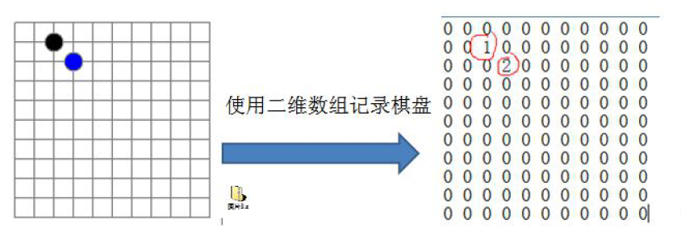
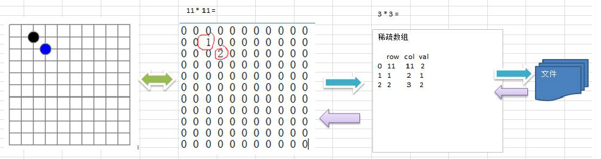

## 线性表
线性表是最基本、最简单、也是最常用的一种数据结构。一个线性表是n个具有相同特性的数据元素的有限序列。

**前驱元素：** ： 若A元素在B元素的前面，则称A为B的前驱元素

**后继元素：** ：若B元素在A元素的后面，则称B为A的后继元素

**线性表的特征** ：数据元素之间具有一种“一对一”的逻辑关系。

1. 第一个数据元素没有前驱，这个数据元素被称为头结点；
2. 最后一个数据元素没有后继，这个数据元素被称为尾结点；
3. 除了第一个和最后一个数据元素外，其他数据元素有且仅有一个前驱和一个后继。

**线性表的分类：** 线性表中数据存储的方式可以是顺序存储，也可以是链式存储，按照数据的存储方式不同，可以把线性表分为顺序
表和链表

> 线性表就是数据排列成一条先一样的结构，每个线性表上的数据最多只有前和后两个方向。除了数组，链表，队列，栈等也是线性表结构

## 数组/顺序表
每一种编程语言中基本都有数组。

### 1. 定义

<font color="Gold"><b>数组（array）是一种线性表数据结构，它用一组连续的内存空间来存储一组具有相同类型的数据。</b></font>

- **顺序表**: 
顺序表是在计算机内存中以数组的形式保存的线性表，线性表的顺序存储是指用一组地址连续的存储单元，依次存
储线性表中的各个元素、使得线性表中再逻辑结构上响铃的数据元素存储在相邻的物理存储单元中，即通过数据元
素物理存储的相邻关系来反映数据元素之间逻辑上的相邻关系。


- **连续的内存空间和相同的数据类型**: 
有了这两个限制，才能让数组可以随机访问。当然有利就有弊，这两个限制也让数组的很多操作变得低效，比如删除和插入操作，为了保证连续性需要做大量的数据搬移工作。

>  数组是最简单、也是使用最广泛的数据结构。栈、队列等其他数据结构均可由数组演变而来。
> 每个数据元素都关联一个正数值，我们称之为索引，它表明数组中每个元素所在的位置。大部分语言将初始索引定义为零。

### 2. 数组是如何根据下标实现随机访问的？
比如一个长度为10的int类型的数组int[] a = new int[10],
<p align="left">

</p>

从图中可以看到，计算机给数组a分配了一块连续的内存1000-1039.其中内存块的首地址为base_address=1000。

我们知道计算机会给每一个内存单元分配一个地址，计算机通过地址来访问内存中的数据。当计算机要访问数组中的某个元素的时候就会通过下面公式寻找地址

```java
a[i]_address = base_address + i*data_type_size
```

这里的data_type_size表示数组中每个元素的大小，因为例子中是int所以大小为4

由于数组集合中存储的数据元素是连续的而且每个元素的数据类型是相同的，所以可以通过数组元素的下标找到他在内存中存储的地址

### 3. 为什么数组的插入和删除是低效的？

#### - 插入操作：

假如数组的长度为n，如果我们需要将一个数据插入到数组中的第k个位置，**为了把第k个位置腾出来，需要把第k~n这部分的元素都顺序的往后挪一位**，操作复杂。

假如一个数组中的数据是有序的，那我们在某一个位置插入一个新的元素的时候就必须得按照上面的方法移动k之后的数据，但是数组中存储的数据如果没有任何规律，这时候，如果想要把某个元素插入到k位置，为了避免大规模的数据搬移，有个简单的办法就是：**直接把k位置的数据搬到数组的最后面，把新元素放到第k个位置**。

> 如果在数组的末尾插入元素，那就不需要移动数据了，插入比较简单，单是如果在数组的头部插入元素就复杂了，需要把所有的数据都往后移动一位。

#### - 删除操作：

跟插入数据类似，如果我们要删除第k个位置的数据，为了**内存的连续性**，也需要**搬移数据**，不然中间就会出现空洞。

在某些情况下，如果我们不要求数据必须是连续的，那么删除的时候可以不真删除，只是把这个元素**标记为已删除**，当**组空间不够用**的时候，在触发一次真正的删除，这样就**大大减少了删除操作导致的搬移操作**。

> 其实JVM的核心垃圾算法就是这个思想

### 4. 数组的基本操作

Insert——在指定索引位置插入一个元素

Get——返回指定索引位置的元素

Delete——删除指定索引位置的元素

Size——得到数组所有元素的数量

### 5. Java 数组详解 

#### 数组初始化的两种方法

- 指定容量： 

```java
int[] arr = new int[20];
```

- 指定初始值

```java
int[] arr = new int[]{10,11,12};
```

#### 代码实现

```java
/**
 * 二次封装我们自己的数组
 * Created by binzhang on 2019/3/15.
 */
public class MyArray {
    private int[] data;
    private int size;

    // 构造函数，传入数组的容量capacity构造Array
    public MyArray(int capacity){
        data = new int[capacity];
        size = 0;
    }

    // 无参数的构造函数，默认数组的容量capacity=10
    public MyArray(){
        this(10);
    }

    // 获取数组中的元素个数
    public int getSize(){
        return size;
    }

    // 获取数组的容量
    public int getCapacity(){
        return data.length;
    }

    // 返回数组是否为空
    public boolean isEmpty(){
        return size == 0;
    }

    // 向所有元素后(数组末）添加一个新元素
    public void addList(int e){
        if(size == data.length)
            throw new IllegalArgumentException("AddLast failed . Array is full.");
        data[size] = e;
        size ++;
    }

    // 向指定位置添加元素时: 在第index个位置插入一个新元素e
    public void add(int index, int e){
        if(size == data.length)
            throw new IllegalArgumentException("AddLast failed . Array is full.");
        if(index < 0 || index > size)
            throw new IllegalArgumentException("Add failed. Require index >= 0 and index <= size.");
        for (int i = size -1; i>= index; i --)
            data[i + 1] = data[i];

        data[index] = e;
        size ++;
    }

    // 在所有元素前添加一个新元素
    public void addFirst(int e){
        add(0,e);
    }

    // 获取index索引位置的元素
    public int get(int index){
        if(index < 0 || index >= size)
            throw new IllegalArgumentException("Add failed. Index is illegal.");
        return data[index];
    }

    public E getLast(){
        return get(size - 1);
    }

    public E getFirst(){
        return get(0);
    }
        
    // 修改index索引位置的元素为e
    public void set(int index, int e){
        if(index < 0 || index >= size)
            throw new IllegalArgumentException("Add failed. Index is illegal.");
        data[index] = e;
    }

    // 查找数组中是否有元素e
    public boolean contains(int e){
        for (int i = 0 ; i < size ; i ++){
            if (data[i] == e)
                return true;
        }
        return false;
    }

    // 查找数组中元素e所在的索引，如果不存在元素e，则返回-1
    public int find(int e){
        for (int i = 0 ; i < size ; i ++){
            if(data[i] == e)
                return i;
        }
        return -1;
    }

     // 从数组中删除index位置的元素，返回删除的元素 ： 将index后的元素都向左移一位即可，最后将size–
    public int remove(int index){
        if(index < 0 || index >= size)
            throw new IllegalArgumentException("Add failed. Index is illegal.");
        int res = data[index];
        for (int i = index + 1 ; i < size ; i ++)
            data[i - 1] = data[i];
        size --;
        data[size] = null;
        return res;
    }

    // 从数组中删除第一个元素，返回删除的元素
    public int removeFirst(){
        return remove(0);
    }

    // 从数组中删除最后一个元素，返回删除的元素
    public int removeLast(){
        return remove(size - 1);
    }

    // 从数组中删除元素e
    public void removeElement(int e){
        int index = find(e);
        if(index != -1)
            remove(index);
    }

    //重新toString方法输出数组信息
    @Override
    public String toString(){
        StringBuilder res = new StringBuilder();
        res.append(String.format("Array: size = %d , capacity = %d\n", size, data.length));
        res.append('[');
        for (int i = 0 ; i < size ; i ++){
            res.append(data[i]);
            if(i != size-1)
                res.append(", ");
        }
        res.append(']');
        return res.toString();
    }
}

public class Main {

    public static void main(String[] args) {

        MyArray arr = new MyArray(20);
        for (int i = 0 ; i < 10 ; i ++){
            arr.addLast(i);
        }
        System.out.println(arr);
    }
}
/* 在控制台的输出为：  
Array: size = 10 , capacity = 20
[0, 1, 2, 3, 4, 5, 6, 7, 8, 9]
Array: size = 11 , capacity = 20
[0, 100, 1, 2, 3, 4, 5, 6, 7, 8, 9]
*/

```

### 6. 泛型数组

#### 定义

- 让我们的数据结构可以放置“任何”数据类型

- 不可以是基本数据类型，只能是类对象

> e.g. : boolean byte char short int long float double

- 每个基本数据类型都有对应的包装类（可以使用）

> e.g. : Boolean Byte Char Short Int Long Float Double

#### 定义泛型数组

```java
/**
 * 定义泛型数组
 * Created by binzhang on 2019/3/15.
 */
public class MyArray<E> {
    private E[] data;
    private int size;

    // 构造函数，传入数组的容量capacity构造Array
    public MyArray(int capacity){
        data = (E[])new Object[capacity];
        size = 0;
    }
	...
}
```

#### 泛型数组使用示例：

> 声明泛型数组要传入要定义的类型: `MyArray<Integer> arr = new MyArray<>(20);`

```java
/**
 * Created by binzhang on 2019/3/16.
 */
public class Student {
    private String name;
    private int score;

    public Student(String studentName, int studentScore){
        this.name = studentName;
        this.score = studentScore;
    }

    @Override
    public String toString() {
        return String.format("Student(name: %s, score: %d)", name, score);
    }

    public static void main(String[] args) {
        MyArray<Student> arr = new MyArray<>();
        arr.addLast(new Student("Alice", 100));
        arr.addLast(new Student("Bob", 99));
        arr.addLast(new Student("chili", 88));
        System.out.println(arr);
    }
}
```

输出： 

```java
ArrayOld: size = 3 , capacity = 10
[Student(name: Alice, score: 100), Student(name: Bob, score: 99), Student(name: chili, score: 88)]
```

### 7. 实现数组的遍历
一般作为容器存储数据，都需要向外部提供遍历的方式，因此我们需要给我们的数组提供遍历方式。

在java中，遍历集合的方式一般都是用的是foreach循环，如果想让我们的SequenceList也能支持foreach循环，则
需要做如下操作：

1. 让SequenceList实现Iterable接口，重写iterator方法；
2. 在SequenceList内部提供一个内部类SIterator,实现Iterator接口，重写hasNext方法和next方法；

```java
// 实现数组的遍历
import java.util.Iterator;

public class MyArray<T> implements Iterable<T>{
    @Override
    public Iterator iterator() {
        return new SIterator();
    }
    private class SIterator implements Iterator{
        private int cur;
        
        public SIterator(){
            this.cur=0;
        }
        
        @Override
        public boolean hasNext() {
            return cur<N;
        }
        
        @Override
        public T next() {
            return eles[cur++];
        }
    }
}

//测试代码
public class Test {
    public static void main(String[] args) throws Exception {
        MyArray<String> squence = new MyArray<>(5);
        //测试遍历
        squence.add(0, "姚明");
        squence.add(1, "科比");
        squence.add(2, "麦迪");
        squence.add(3, "艾佛森");
        squence.add(4, "卡特");
        for (String s : squence) {
            System.out.println(s);
        }
    }
}

```


### 8. 动态数组
在之前的实现中，当我们使用MyArray时，先new MyArray(5)创建一个对象，创建对象时就需要指定容
器的大小，初始化指定大小的数组来存储元素，当我们插入元素时，如果已经插入了5个元素，还要继续插入数
据，则会报错，就不能插入了。这种设计不符合容器的设计理念，因此我们在设计顺序表时，应该考虑它的容量的
伸缩性。

动态数组可以简单理解为动态扩容(改变存储数据元素的数组的大小），如下图所示当我们的data数组原容量只有4，且里面已经有四个元素，无法再次添加，我们可以先定义一个新数组newData，他的容量是data的二倍，将data中的数据拷贝到newData中，再将data指向newData，释放原数组的空间和newData引用，就完成了动态扩容，这就是动态数组。要注意的是，旧数组拷贝到新数组是要进行遍历的。

<p align="left">

</p>

```java
// 在第index个位置插入一个新元素e
public void add(int index, E e){
    if(index < 0 || index > size)
        throw new IllegalArgumentException("Add failed. Require index >= 0 and index <= size.");

    //当要插入的位置size等于数组容量capacity/data.length时，进行动态扩容。
    if(size == data.length)
        resize(2 * data.length);

    for (int i = size -1; i>= index; i --)
        data[i + 1] = data[i];

    data[index] = e;
    size ++;
}

// 扩容方法设置为私有的，用户不可在外部调用
private void resize(int newCapacity){
    E[] newData = (E[]) new Object[newCapacity];
    for (int i = 0 ; i < size ; i ++)
        newData[i] = data[i];
    data = newData;
}
```

移除元素时，应该检查当前数组的大小是否太大，比如正在用100个容量的数组存储10个元素，这样就会造成内存
空间的浪费，应该创建一个容量更小的数组存储元素。如果我们发现数据元素的数量不足数组容量的1/4，则创建
一个是原数组容量的1/2的新数组存储元素。

```java
// 同理我们也可以考虑在remove方法中加入动态减少数组空间的操作了。
// 从数组中删除index位置的元素，返回删除的元素
public E remove(int index){
    if(index < 0 || index >= size)
        throw new IllegalArgumentException("Add failed. Index is illegal.");

    E res = data[index];
    for (int i = index + 1 ; i < size ; i ++)
        data[i - 1] = data[i];
    size --;
    data[size] = null;

    // 动态减少数组容量
    if (size == data.length / 2 && data.length / 2 != 0)
        resize(data.length / 2);

    return res;
}

```


### 9. 数组的时间复杂度

- O(1)，O(n)，O(nlogn)，O(n^2)

> 大O描述的是算法的运行时间和输入数据之间的关系

#### 分析动态数组的时间复杂度

操作| 时间复杂度 | 常规 
-----|------|------|
添加操作|O(n)| <ul><li> addLast(e): O(1)</li><li>addFirst(e): O(n)</li><li>add(index, e): O(n/2) = O(n)</li></ul>
删除操作| O(n)|<ul><li> removeLast(e): O(1)</li><li>removeFirst(e): O(n)</li><li>remove(index, e): O(n/2) = O(n)</li></ul>
修改操作| 已知索引O(1)；未知索引O(n) | <ul><li> set(index, e) : O(1)</li><li> set(e) : O(n)</li>
查找操作| 已知索引O(1)；未知索引O(n) | <ul><li> get(index): O(1)</li><li>contains(e): O(n)</li><li>find(e): O(n)</li></ul>


> 时间复杂度我们通常考虑最糟糕的情况，所以添加操作的时间复杂度就是O(n)

> 注意对于增删最后一条元素，因为要考虑到resize所以时间复杂度依然是O(n)

总结：

- 增：O(n)
- 删：O(n)
- 改：已知索引O(1)；未知索引O(n)
- 查：已知索引O(1)；未知索引O(n)

#### 复杂度震荡问题
当我们的数组容量满的时候，再次添加一个元素，会触发扩容机制，然后再将这个元素删除，又会触发缩减容量的机制，明显这样对我们系统的资源是很大的浪费。

**出现问题的原因**：removeLast时resize过于着急（Eager）

**解决方法**：当 size == capacity / 4 时，才将capacity减半（Lazy）


### 10. Java ArrayList的实现

java中的ArrayList相当与一个动态数组，支持扩容。它可以把很多数组操作的细节封装起来，比如数组的插入和删除。

- **预先指定其大小** ： 数组在定义的时候，因为需要给它分配连续的内存空间，需要预先指定其大小，当存放的数据大于其大小的时候，我们需要从新分配一块更大的空间，把原来的复制过去在插入新的元素。

- **扩容** ： ArrayList中，当空间不够用的时候，它会自动扩容为原来的1.5倍的大小。

因为扩容设计到**内存的申请和数据的搬移**，这是比较耗时的，所以，如果事先能确定数据的大小，做好在创建ArrayList的时候指定其大小

#### java 数组 v.s ArrayList 
虽然ArrayList比数组好用，不过有些时候使用数组会更好一些。我们需要根据实际应用场景的需求进行选择

1）**ArrayList无法存储基本类型**：int long等需要封装成Integer,Long类，而**自动装箱和拆箱的操作也会有一定的性能消耗**，所以如果关注性能或者想用基本类型就选用数组

2）如果数据的大小已经知道，并且对数据的操作简单，可以直接使用数组

3）当使用多维数组的时候，用数组表示起来更加直观比如int[][]arr；而用容器的话则需要这样定义ArrayList arr。

> 在开发中，一般情况下直接使用ArrayList就可以，如果是偏底层的开发比如网络框架开发等需要更高的性能，使用数组更合适。


### 11. 算法之稀疏数组 ： 数据压缩

#### （1） 应用实例

- 编写的五子棋程序中，有存盘退出和续上盘的功能。

<p align="left">



</p>

**分析问题**： 因为该二维数组的很多值是默认值0. 因此记录了很多没有意义的数据 -> 稀疏数组

#### （2）基本介绍
当一个数组中大部分元素为0，或者为同一个值的数组时，可以使用稀疏数组来保存该数组

- **处理方法**

a. 记录数组一共有几行几列，有多少个不同的值

b. 把具有不同值得元素的行列及值记录在一个小规模的数组中，从而缩小程序的规模

- **举例说明**

<p align ="left">

原始二维数组： 6*7 = 42个数据

 | | | | | | | | 
---|----|---|----|----|----|----|
0|0|0|22|0|0|15
0|11|0|0|0|17|0
0|0|0|-6|0|0|0
0|0|0|0|0|39|0
91|0|0|0|0|0|0|
0|0|28|0|0|0|0|

稀疏数组：9 * 3 = 27个数据 （ 数组第一个元素记录数组一共有几行几列，有多少个不同的值）

| |row|col|value
 ---|---|---|---|
 [0]|6|7|8
 [1]|0|3|22
 [2]|0|6|15
 [3]|1|1|11
 [4]|1|5|17
 [5]|2|3|-6
 [6]|3|5|39
 [7]|4|0|91
 [8]|5|2|28

</p>

#### （3） 整体思路分析

- 使用稀疏数组，来保留类似前面的二维数组（棋盘、地图等）
- 把稀疏数组存盘，并且可以从新恢复原来的二维数组数

 <p align="left">
 
 

 </p>

**二维数组 转 稀疏数组的思路**

1. 遍历原始的二维数组，得到有效数组的个数 `sum`
2. 根据`sum`就可以创建稀疏数组 `sparseArr int[sum+1][3]`
3. 将二维数组的有效数据存入到稀疏数组中

**稀疏数组 转 原始的二维数组的思路**

1. 先读取稀疏数组的第一行，根据第一行的数组，创建原始的二维数组，比如上面的 `chessArr2 = int[11][11]`
2. 在读取稀疏数组后几行的数据，并赋给原始的二维数组即可

#### （4）代码实现

```java
public class SparseArray{
    public static void main(String[] args){
        // 创建一个原始的二维数组 11*11
        // 0：表示没有棋子 1： 表示黑子 2：表示篮子
        int chessArr1[][] = new int[11][11];
        chessArr1[1][2] = 1;
        chessArr1[2][3] = 2;
        chessArr1[4][5] = 2;

        //输出原始数组的形式
        System.out.println("原始的二维数组：")；
        for (int[] row : chessArr1){
            for(int data : row){
                System.out.printf("%d\t",data);
            }
            System.out.println();
        }
        // 将二维数组转换成稀疏数组
        // 1.先遍历二维数组 得到非0数据的个数
        int sum = 0;
        for (int i =0;i< chessArr1.length;i++){
            for (int j=0;j<chessArr1[i].length;j++){
                if (chessArr1[i][j] != 0){
                    sum++;
                }
            }
        }
        System.ouot.println("sum = "+sum);
        // 2. 创建对应的稀疏数组
        int sparseArr[][] = new int[sum+1][3];
        // 给稀疏数组赋值
        sparseArr[0][0] = 11;
        sparseArr[0][1] = 11;
        sparseArr[0][2] = sum;

        // 遍历二维数组将非零的值存放到稀疏数组sparseArr中
        // 其实可以在第一次遍历原始数组的时候，将非0的值和它的坐标保存到一个数组中且sum的取值则为数组的大小 （有效元素的个数）
        int count = 0; // count 用于记录是第几个非0数据
        for (int i =0;i< chessArr1.length;i++){
            for (int j=0;j<chessArr1[i].length;j++){
                if (chessArr1[i][j] != 0){
                    count++;
                    sparseArr[count][0] = i;
                    sparseArr[count][1] = j;
                    sparseArr[count][2] = chessArr1[i][j]
                }
            }
        }

        //输出稀疏数组的形式
        System.out.println();
        System.out.println("所得的稀疏数组为： ");
        for (int i=0;i<sparseArr.length;i++){
            System.out.printf("%d\t%d\t%d\t\n",sparseArr[i][0],sparseArr[i][1],sparseArr[i][2]);
        }
        System.out.println();

        // 将稀疏数组恢复成原始的二维数组
        // 1. 先读取稀疏数组的第一行，根据第一行的数组，创建原始的二维数组
        int chessArr2[][] = new int[sparseArr[0][0]][sparseArr[0][1]];

        // 2. 在读取稀疏数组后几行的数据（从第二行开始），并赋给原始的二维数组即可
        for (int i=1; i<sparseArr.length;i++){
            chessArr2[sparseArr[i][0]][sparseArr[i][1]] = sparseArr[i][2];
        }

        // 输出恢复后的二维数组
        System.out.println("恢复后的二维数组：");
        for (int[] row : chessArr2){
            for(int data : row){
                System.out.printf("%d\t",data);
            }
            System.out.println();
        }
    }
}
```

### 12. 面试中关于数组的常见问题

a. 寻找数组中第二小的元素

b. 找到数组中第一个不重复出现的整数

c. 合并两个有序数组

d. 重新排列数组中的正值和负值
