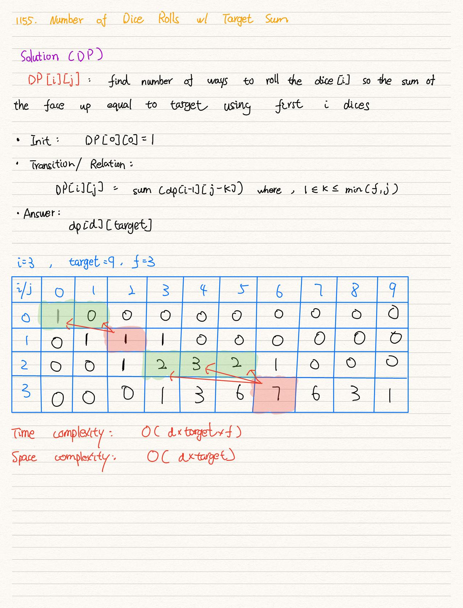
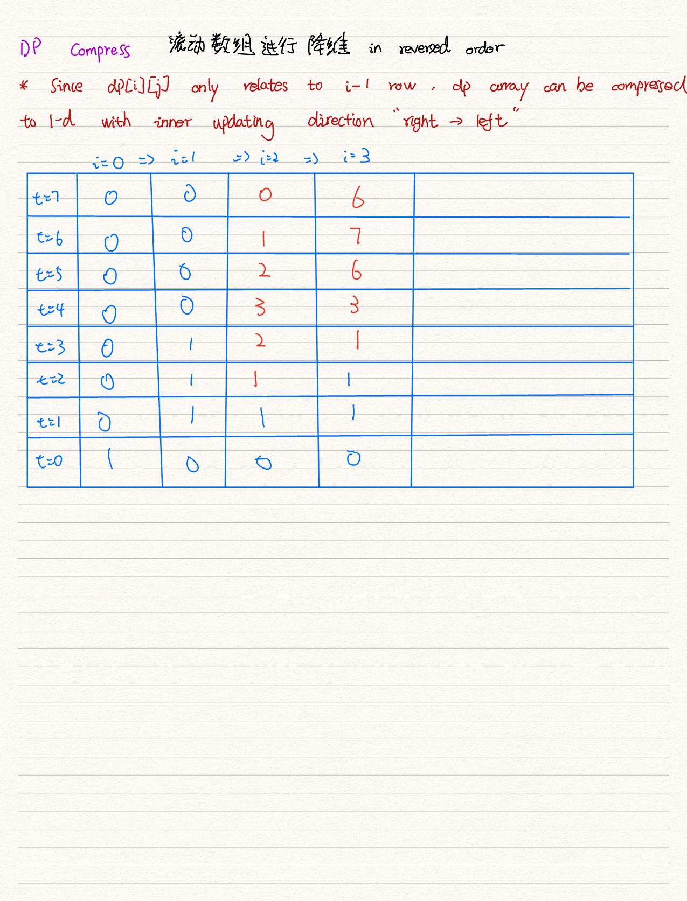
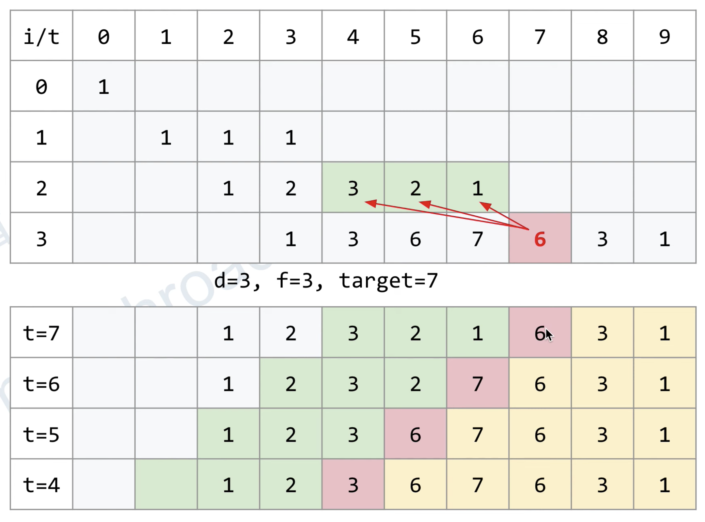

1155. Number of Dice Rolls With Target Sum

You have d dice, and each die has f faces numbered 1, 2, ..., f.

Return the number of possible ways (out of fd total ways) modulo 10^9 + 7 to roll the dice so the sum of the face up numbers equals target.

**Constraints**:

1. 1 <= d, f <= 30
2. 1 <= target <= 1000

**Example** 

```
Input: d = 1, f = 6, target = 3
Output: 1
Explanation: 
You throw one die with 6 faces.  There is only one way to get a sum of 3.
```

```
Input: d = 2, f = 6, target = 7
Output: 6
Explanation: 
You throw two dice, each with 6 faces.  There are 6 ways to get a sum of 7:
1+6, 2+5, 3+4, 4+3, 5+2, 6+1.
```

```
Input: d = 2, f = 5, target = 10
Output: 1
Explanation: 
You throw two dice, each with 5 faces.  There is only one way to get a sum of 10: 5+5.
```

```
Input: d = 1, f = 2, target = 3
Output: 0
Explanation: 
You throw one die with 2 faces.  There is no way to get a sum of 3.
```

```
Input: d = 30, f = 30, target = 500
Output: 222616187
Explanation: 
The answer must be returned modulo 10^9 + 7.
```





```python
for (int rep = 1; rep <= d; ++rep) {
   vector<int> new_ways(target+1);
   for (int already = 0; already <= target; ++already) {
       for (int pipe = 1; pipe <= f; ++pipe) {
           if (already - pipe >= 0) {
               new_ways[already] += ways[already - pipe];
               new_ways[already] %= mod;
           }
       }
   }
   ways = new_ways;
}
```
