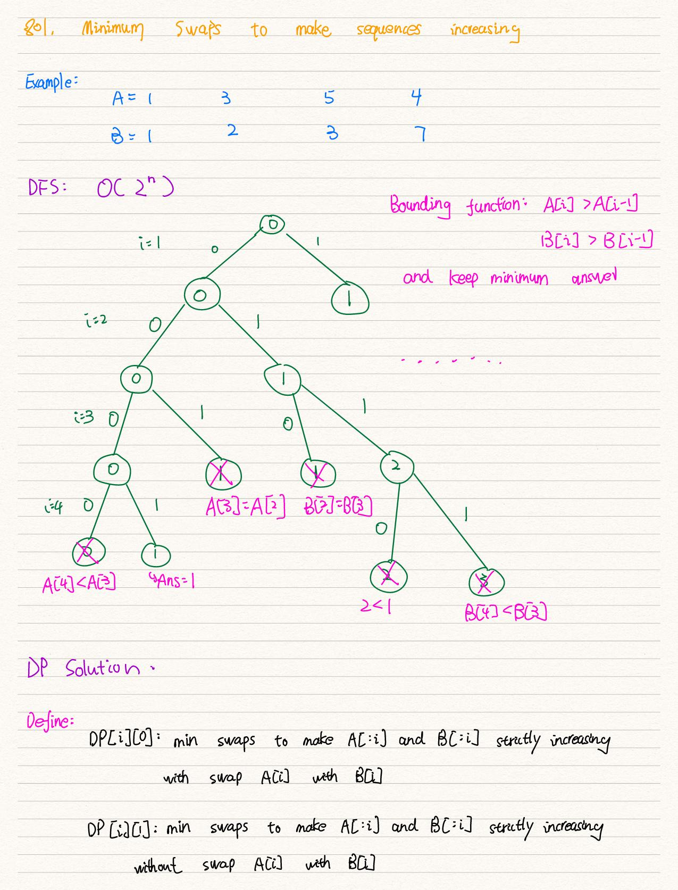
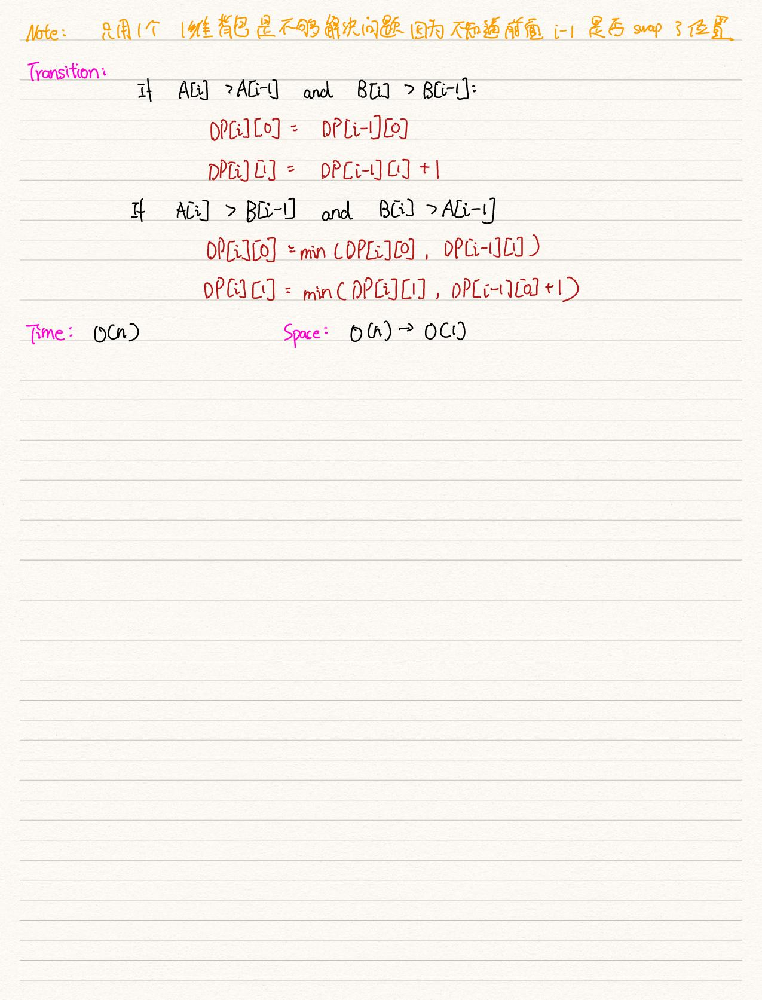

# 801. Minimum Swaps To Make Sequences Increasing
We have two integer sequences A and B of the same non-zero length.

We are allowed to swap elements A[i] and B[i].  Note that both elements are in
the same index position in their respective sequences.

At the end of some number of swaps, A and B are both strictly increasing.  (A
sequence is strictly increasing if and only if A[0] < A[1] < A[2] < ... <
A[A.length - 1].)

Given A and B, return the minimum number of swaps to make both sequences
strictly increasing.  It is guaranteed that the given input always makes it
possible.

**Examples**:
```
Input: A = [1,3,5,4], B = [1,2,3,7]
Output: 1
Explanation: 
Swap A[3] and B[3].  Then the sequences are:
A = [1, 3, 5, 7] and B = [1, 2, 3, 4]
which are both strictly increasing.
```

**Notes**:
- A, B are arrays with the same length, and that length will be in the range [1, 1000]
- A[i], B[i] are integer values in the range [0, 2000]



