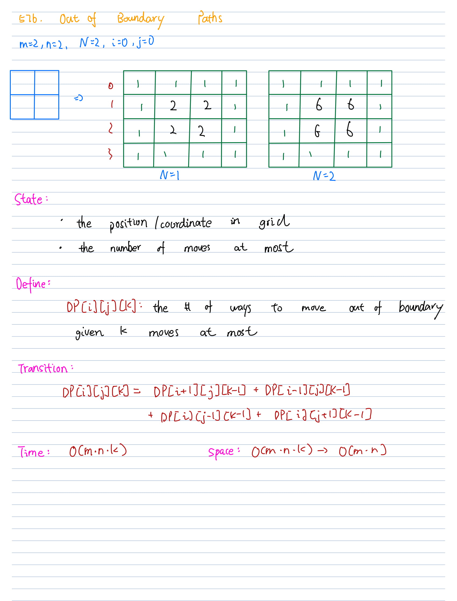

# 576. Out of Boundary Paths (MEDIUM)

There is an m by n grid with a ball. Given the start coordinate (i,j) of the
ball, you can move the ball to adjacent cell or cross the grid boundary in four
directions (up, down, left, right). However, you can at most move N times. Find
out the number of paths to move the ball out of grid boundary. The answer may be
very large, return it after mod 109 + 7.

**Notes**

- Once you move the ball out of boundary, you cannot move it back.
- The length and height of the grid is in range [1,50].
- N is in range [0,50].

**Examples**

```
Input: m = 2, n = 2, N = 2, i = 0, j = 0
Output: 6
```

Explanation:


```
Input: m = 1, n = 3, N = 3, i = 0, j = 1
Output: 12
```

Explanation:




