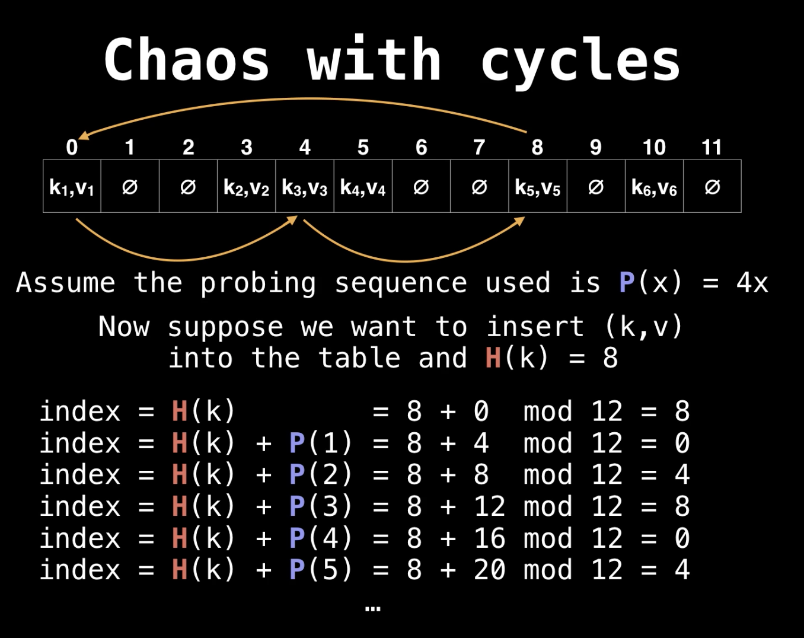

# Hash table 

# Table of contents 
- [哈希表简介 Introduction](#Introduction)
    * [Definition](#Definition)
    * [Uses](#Uses)
    * [Data structure](#Hash-table-mapping-(key->value))


- [哈希方程 Hash Function](#Hashing-function)
    * [Examples](#Hashing-function-exmaples)
    * [Properties](#Properties)


- [冲突处理方法 Collision Handling](#Collisions-Handling)
    * [链地址法 Separate Chaining](#Separate-Chaining)
        + [Chaining Implementation](#Chaining-Implementation)
    * [开放定址法 Open Addressing](#Open-Addressing)
        + [Implementations](#Implementations)
        + [探测法s Probing sequences](#Probing-sequence)
    * [Open Addressing v.s Seprate Chaining](#Open-Addressing-v.s-Separate-Chaining)

- [When hash table operations cost O(n) time](#When-hash-table-operations-cost-O(n)-time)

- [Strenths](#Strenths)

- [Weakness](#Weaknesses)


# Introduction
## Definition  

- Hash table provides a mapping from keys to values using a technique called **hashing**
- A hash table/Dictionary organizes data so you can quickly look up values for a given key.
- Key-value pairs can be of any type not just strings and numbers but also objects. But keys needs to be **hashable** 

<p>

</p>

## Uses

- Frequencies: Hash tables are often used to track item frequencies. For example, counting the number of times a word appears in a given text. 

## Hash table mapping (key->value)

- **Hash table is built on arrays**

Arrays are pretty similar to hash maps already. Arrays let you quickly look up the value for a given "key" . . . except the **keys are called "indices,"** and we don't get to pick them—they're always sequential integers (0, 1, 2, 3, etc). **Think of a hash map as a "hack" on top of an array** to let us use flexible keys instead of being stuck with sequential integer "indices."

# Hashing Function

- **Definition** : 

A hash function maps a key 'x' to a whole number in a fixed range

- **Implementation in hash table**

A function to **convert a key into an array index (an integer)**. To look up the value for a given key, we just run the key through our hashing function to get the index to go to in our underlying array to grab the value.

<p>

</p>

## Hashing function exmaples

### Hash function for arbitrary objects such as strings/lists: ASCII

The hash function H(s) can be defined as the ASCII(x) value of the character x and H(S)= sum(ASCII(x)). Grab the number value for each character and add those up

``` python
  def H(s):
    sum = 0
    for char in s:
        sum = sum + ASCII(char)
    return sum mod 30 
```

<p>

</p>

The result is 429. But what if we only have 30 slots in our array? We'll use a common trick for forcing a number into a specific range: the modulus operator (%). Modding our sum by 30 ensures we get a whole number that's less than 30 (and at least 0): 

> 429%30 = 9

### Hash function for integer key: Modular
For example, H(X) = (x^2 - 6x +9) mod 10 maps all integer keys to the range [0,9]
```
H(4) = (16 - 24 +9) mod 10 = 1 
H(-7) = (49 + 42 + 9 ) mod 10 = 0
```

> Notes: The hashing functions used in modern systems get pretty complicated—the one we used here is a simplified example.

## **Properties**

1. If H(x) = H(y), then objects x and y **might be equal**, but if H(x) != H(y) then x and y are **certainly not equal** 

> This means that instead of comparing x and y directly, a smarter approach is to first compare their hash values ( O(1) ), and only if the hash values match do we need to explicitly compare x and y 

2. A hash function must be **deterministic** 

> This means tat if H(X) = y then H(X) must always product y and never another value. 

## Notes 

> A good hash function should have following properties

1) Efficiently computable.
2) Should uniformly distribute the keys (Each table position equally likely for each key)

> A key of type T is **hashable**  
 
To enforce a deterministic hash function, we demand that the keys used in the hash table are **immutable** data types. If a key of type T is immutable and we have a hash function H(k) defined for all keys k of type T then we say a key of type T is hashable

> Ideally we would like to have a very fast lookup and other operations for the data we are placing within the hash table    
 
Remarkably we can achieve this in O(1) time using a **hash function as a way to index into a hash table**. The constant time behavior attributed to hash tables is only true if you have a good **uniform hash function**


# Collisions Handling

**Definition**: Hash Collisions happens while two keys hash to the same index in the "array". The situation where a newly inserted key maps to an already occupied slot in the hash table is called a collision. 

<p>

</p>

## Separate Chaining

<p>

</p>

The idea is to make each cell of hash table point to a linked list of records that have the same hash function value. Chaining is simple but requires additional memory outside the table.

Instead of storing the actual values in our array, let's have each array slot hold a pointer to a linked list holding the values for all the keys that hash to that index:

> Notice that we **included the keys as well as the values** in each linked list node. Otherwise, we wouldn't know which key was for which value!

### Chaining Implementation
1) To find the key, we first hash the key x to obtain the hash value (index) h(x)
2) After this, we search the h(x) bucket (look through the linked list) for the key x and value

### Advantages
1) Simple to implement.
2) Hash table never fills up, we can always add more elements to the chain.
3) Less sensitive to the hash function or load factors.
4) It is mostly used when it is unknown how many and how frequently keys may be inserted or deleted.

### Disadvantages
1) Cache performance of chaining is not good as keys are stored using a linked list. Open addressing provides better cache performance as everything is stored in the same table.
2) Wastage of Space (Some Parts of hash table are never used)
3) If the chain becomes long, then search/insertion time can become O(n) in the worst case.
4) Uses extra space for links.

### FAQs

  * **How to maintain O(1) insertion and lookup time complexity once hash table with separate Chaining gets really full ( long linked list chains )?**

Ans: We should create a new HT with a larger capacity and rehash all the items inside the old HT and disperse them throughout the new HT at different locations 

  * **How to remove key-value pairs from HT?**

Ans : Apply the same procedure as doing a lookup for a key but instead of returing the value associated with the key, remove the node in the linked list data structure 

### [Hash table separate chaining source code](https://www.youtube.com/watch?v=Av9kwXkuQFw&list=PLDV1Zeh2NRsB6SWUrDFW2RmDotAfPbeHu&index=31)


## Open Addressing

<p>

</p>

Open addressing techniques deals with hash collisions by finding another place within the hash table for the object to go by **offsetting it from the position to which it hashed to**. The key-value pairs are stored in the table(array) itself as opposed to a data structure like in separate chaining    
In open addressing, All elements are stored in the hash table itself. Each table entry contains either a record or NIL. 

> Notes: At any point, size of the table must be greater than or equal to the total number of keys ( we can increase table size by copying old data if needed).
 
- **Load Factor**

When using open addressing as a collision resolution technique, we need to care a great deal about the size of our hash table and how many elements are currently in the table 
```
Load factor = items in table/size of table
```


-  Assume the max load facor = a, then threshold before resize = N * a (the number of element allowed in the table before resize)

### Implementations 

When we want to insert a (k,v) into the hash table, 
1. we obtain the original position by hashing the key H(k)
2. If the posiiton the key hashed to is occupied, we try another position in the hash table by offsetting the current position subject to **probing sequence P(X)**
3. We keep doing this until an unoccupied slot is found 
4. Before we insert the next pair, if we have reached the threshold value, we need to grow the table which usuallly done in some exponential fashion such as doubling the table size whatever you do make suze GCD(N,a) = 1 still holds 
    1) The new threshold value = 2*N*a 
    2) The probing function p(x) does not change 
    3) Upon allocating memory for a new table, we need to insert the contents of the old table into the new table using new hash function H'(x) which takes O(n)

```python
# General insertion method for open addressing on a table of size N 
    def insert(x):
        x = 1
        keyHash = H(k)
        index = keyHash 
        while table[index] != None:
            index = (KeyHash + P(k,x)) mod N
            x = x+1
        insert(k,v) at table[index]
# H(k) is the hash for the key k 
# P(k,x) is the probing function 
```

#### Key searching 

**Search(k)**: Keep probing until slot’s key doesn’t become equal to k or an empty slot is reached.

#### [Key removal](https://www.youtube.com/watch?v=7eLDTtbzX4M&list=PLDV1Zeh2NRsB6SWUrDFW2RmDotAfPbeHu&index=36)

**Delete(k)**: Delete operation is interesting. If we simply delete a key, then search may fail because the probing would stop at null/empty slot. So slots of deleted keys are uniquely marked specially as “deleted” called a **tombstone**.

> Notes : Insert can insert an item in a deleted slot, but the search doesn’t stop at a deleted slot.

**Removing Tombstone**:
1) Tombstones count as filled slots in the HT so they increase the load factor and will be removed when the table is resized 

2) when inserting a new (k,v) pair you can replace buckets with tombstones with the new pair

### Probing sequence

#### Problems with probing: chaos with cycles 
Most randomly selected probing sequence modulo N will product a cycle shorter than the table size. This becomes problematic when you are trying to insert a key-value pair and all the buckets on the cycle are occupied because you will get stuck in the **infinite loop**



The cycle makes it impossible to reach other buckets and this would cause an infinite loop in HT iif all the buckets it go through were already occupied 

- **How do we handle probing functiosn which produce cycles shorter than the table size?**

In general, the consensus is that we don't handle this issue, instead we avoid it altogheter by restriciting our domain of probing functions to those which produce a cycle of exactly length N*

#### [Linear probing](https://www.youtube.com/watch?v=Ma9XOInZJWM&list=PLDV1Zeh2NRsB6SWUrDFW2RmDotAfPbeHu&index=33)

LP is a probing method which probes according to a linear formula, 

```
P(X) = ax+ b where a(!= 0), b(= 0) are constants 
```

 - Which value(s) of the constant a in P(x) = ax produce a full cycle modulo N? 

 This hapens when a and N are **relatively prime**. Hence, when GCD(a,N) = 1 the probing function P(x) be able to generate a complete cycle and we will always be able to find am **empty bucket**

> Common choice for linear P(x) is P(x) = 1x since GCD(N,1) = 1 no matter the choice of N(table size)


- **Clustering** : The main problem with linear probing is clustering, many consecutive elements form groups and it starts taking time to find a free slot or to search an element.


#### [Quadratic probing](https://www.youtube.com/watch?v=b0858c55TGQ&list=PLDV1Zeh2NRsB6SWUrDFW2RmDotAfPbeHu&index=34)
QP is a probing method which probes according to a quadratic formula, 

```
P(X) = ax^2 + bx + c, where a,b,c are constants and a!= 0 
```

- Some quadratic probing function we can work with without generating cycle:

1) Let p(x) = x^2, keep the talbe size a prime number > 3 and also keep load factor <= 1/2
2) Let p(x) = (x^2 + x)/2 and keep the table size a power of two 
3) Let p(x) = （-1^x) * x^2 and keep the table size of prime N where N = 3 mod 4

#### [Double hashing](https://www.youtube.com/watch?v=H5e9V5x92vI&list=PLDV1Zeh2NRsB6SWUrDFW2RmDotAfPbeHu&index=35)

DH is a probing method which probes according to a constant multiple of another hash fucntion 

```
P(k,x) = x * H'(k), wherhe H'(k) is a secondary hash function and H'(k) must hash the same type of keys as H(k)
```

> Doubling hashing reduces to linear probing (except that the constant is unknowm until runtime )

- To fix the issue of cycles we pick the table size to be a prime number and also compute the value of delta :

> delta  = H'(k) mod N

If delta = 0 then we are guaranteed to be stuck in a cycle so we set delta = 1 at this point
 
Notice that 1 <= delta N and GCD(delta,N) = 1 since N is prime. Hence, with these conditions we know that modulo N the sequence : H(k),H(k) + 1delta,H(k)+2delta is certain to have order N

- Constructing H'(k)

Frequently the hash functions selected to compose H'(k) are picked from a pool of hash functions called **universal hash functions** which generally operate on one fundamental data type 


### [Souce code](https://www.youtube.com/watch?v=eer6yW4S4Ts&list=PLDV1Zeh2NRsB6SWUrDFW2RmDotAfPbeHu&index=37)

## Open Addressing v.s Separate Chaining

Both function generate O(1) search/insert function in aveage case and O(n) in worst case. The advantages of using separate Chaining are that we don't need to care about the resizing since the table will always not get filled (but we do need to resize if the table grows too large), and the choice of hash function is not sensitive and easy to implement. However the cache performance is worse than open addressing because it is not cache friendly. And we need extra space for the other data strucutre( i.e linked list)
Open addressing holds all the element in one table which reduce the usage of space and generate great performance in cache since all the element are hold in one chunk of memory. However, open address is not easy to implement and is sensitive to the choice of probing function and hash function to avoid cycling/infinite loop. Also the table may become filled and we need to care about the size of table and the threshold. 

NO.|Seprate Chaining|Open Addressing
----|----|----|
1.|Chaining is Simpler to implement.|Open Addressing requires more computation. It is also sensition to chosen hash function and probing function
2.|In chaining, Hash table never fills up, we can always add more elements to chain.|In open addressing, table may become full.
3.|Chaining is Less sensitive to the hash function or load factors.|Open addressing requires extra care for to avoid clustering and load factor.
4.|Chaining is mostly used when it is unknown how many and how frequently keys may be inserted or deleted.|Open addressing is used when the frequency and number of keys is known.
4.|Cache performance of chaining is not good as keys are stored using linked list.|Open addressing provides better cache performance as everything is stored in the same table.
5.|Wastage of Space (Some Parts of hash table in chaining are never used).|In Open addressing, a slot can be used even if an input doesn’t map to it.
6.|Chaining uses extra space for links.	|No links in Open addressing


# When hash table operations cost O(n) time

- **Hash collisions**
If all our keys caused hash collisions, we'd be at risk of having to walk through all of our values for a single lookup (in the example above, we'd have one big linked list). This is unlikely, but it could happen. That's the worst case.

- **Dynamic array resizing**
Suppose we keep adding more items to our hash map. As the number of keys and values in our hash map exceeds the number of indices in the underlying array, hash collisions become inevitable.
To mitigate this, we could expand our underlying array whenever things start to get crowded. That requires **allocating a larger array and rehashing all of our existing keys to figure out their new position—O(n) time**.

# Strenths 

- **Fast lookups** Lookups take O(1) time on average.
- **Flexible keys** Most data types can be used for keys, as long as they're hashable.

# Weaknesses 

- **Slow worst-case lookups**: Lookups take O(n) time in the worst case.
- **Unordered**: Keys aren't stored in a special order. If you're looking for the smallest key, the largest key, or all the keys in a range, you'll need to look through every key to find it.
- **Single-directional lookups**: While you can look up the value for a given key in O(1) time, looking up the keys for a given value requires looping through the whole dataset—O(n)time.
- **Not cache-friendly**:  Many hash table implementations use linked lists, which don't put data next to each other in memory.

# Declaration in python 
In Python 2.7, hash tables are called dictionaries.
```python
  light_bulb_to_hours_of_light = {
    'incandescent': 1200,
    'compact fluorescent': 10000,
    'LED': 50000,
}
```

# Time Complexity 
Ops|Average Case|Worst Case 
---|---|---|
Space|O(n)|O(n)
Insert|O(1)|O(n)
Lookup|O(1)|O(n)
Delete|O(1)|O(n)

# Sets 

## Definitions 
A set is like a hash map except it only stores keys, without values. 

## Uses 
- **Graphs** :  
Sets often come up when we're tracking groups of items—nodes we've visited in a graph, characters we've seen in a string, or colors used by neighboring nodes. Usually, we're interested in whether something is in a set or not.

## Implementation 
Sets are usually implemented very similarly to hash maps—using hashing to index into an array—but they don't have to worry about storing values alongside keys. 

```python 
  light_bulbs = set()

light_bulbs.add('incandescent')
light_bulbs.add('compact fluorescent')
light_bulbs.add('LED')

'LED' in light_bulbs  # True
'halogen' in light_bulbs  # False
```

