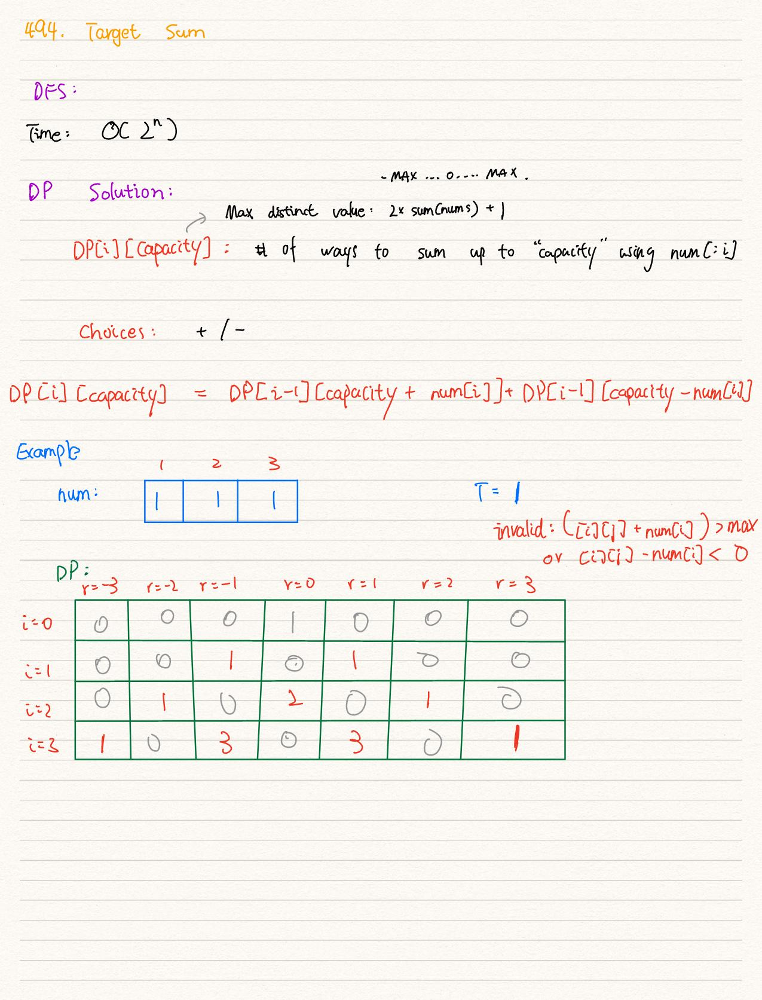
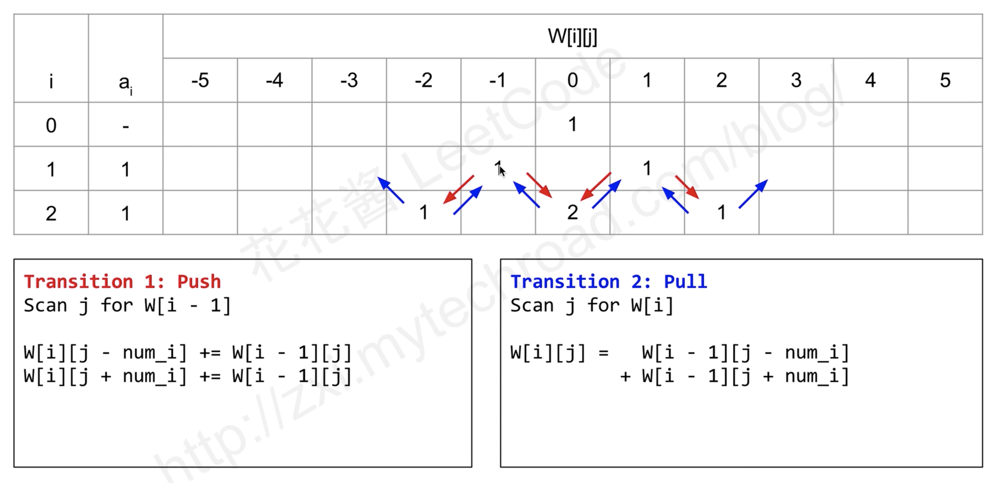
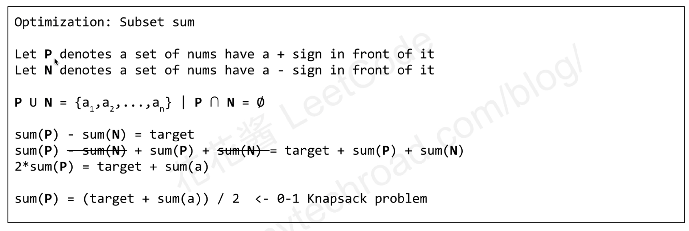
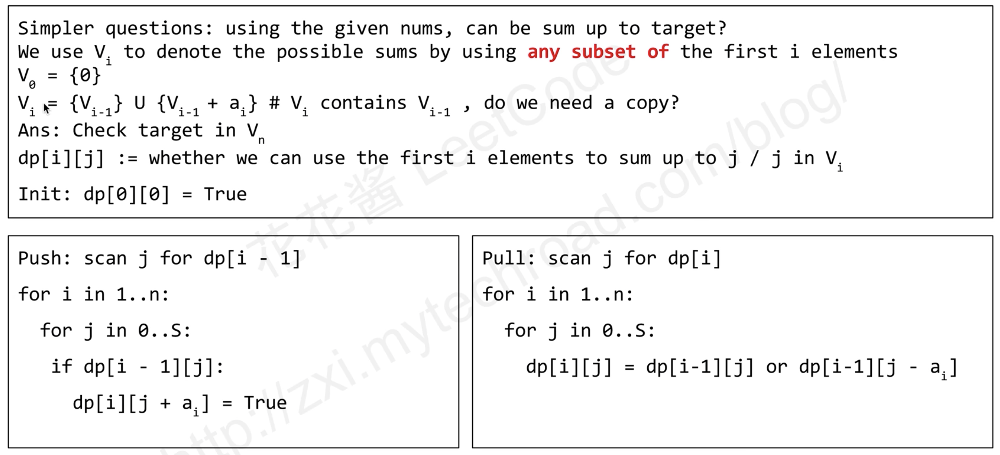
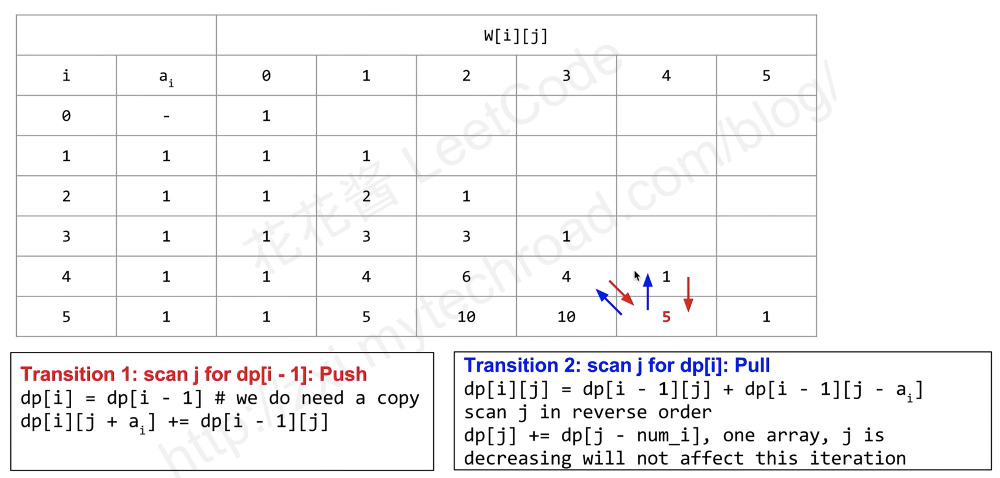

494. Target Sum ( Medium )

You are given a list of non-negative integers, a1, a2, ..., an, and a target, S.
Now you have 2 symbols + and -. For each integer, you should choose one from +
and - as its new symbol.

Find out how many ways to assign symbols to make sum of integers equal to target S.

**Example**
```
Input: nums is [1, 1, 1, 1, 1], S is 3.     
Output: 5   
Explanation:    

-1+1+1+1+1 = 3  
+1-1+1+1+1 = 3  
+1+1-1+1+1 = 3  
+1+1+1-1+1 = 3  
+1+1+1+1-1 = 3  

There are 5 ways to assign symbols to make the sum of nums be target 3. 
```

**Constraints**:

- The length of the given array is positive and will not exceed 20.
- The sum of elements in the given array will not exceed 1000.
- Your output answer is guaranteed to be fitted in a 32-bit integer.



## Two way for DP solution 


## [Optimization : 0/1 knapsack](https://www.youtube.com/watch?v=zks6mN06xdQ)



